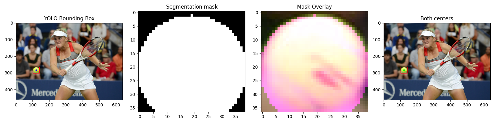
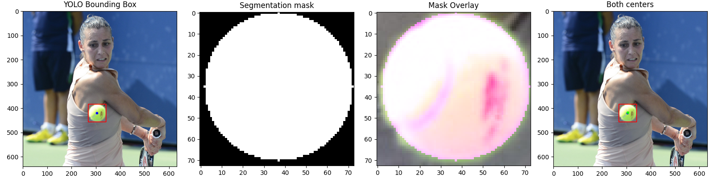
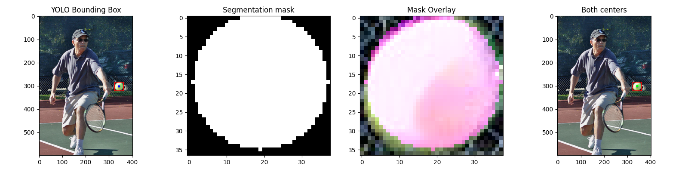
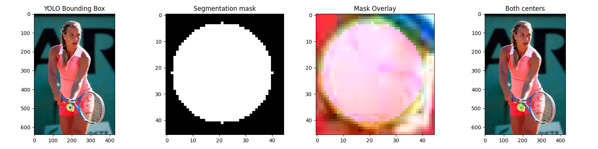
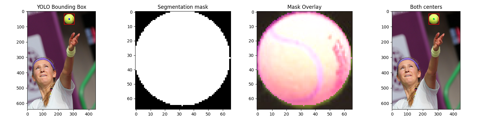
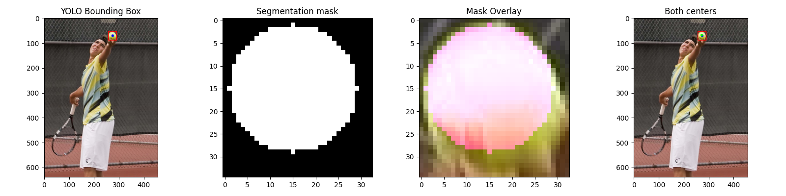
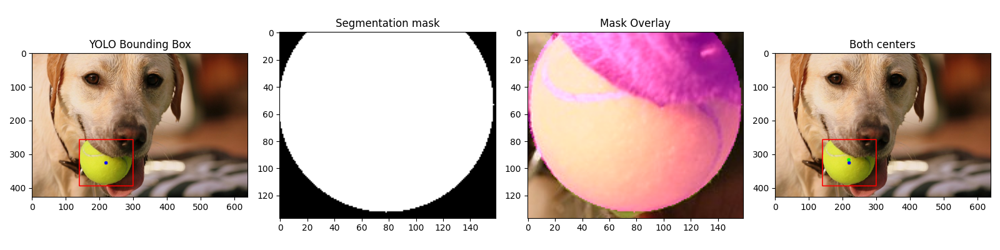
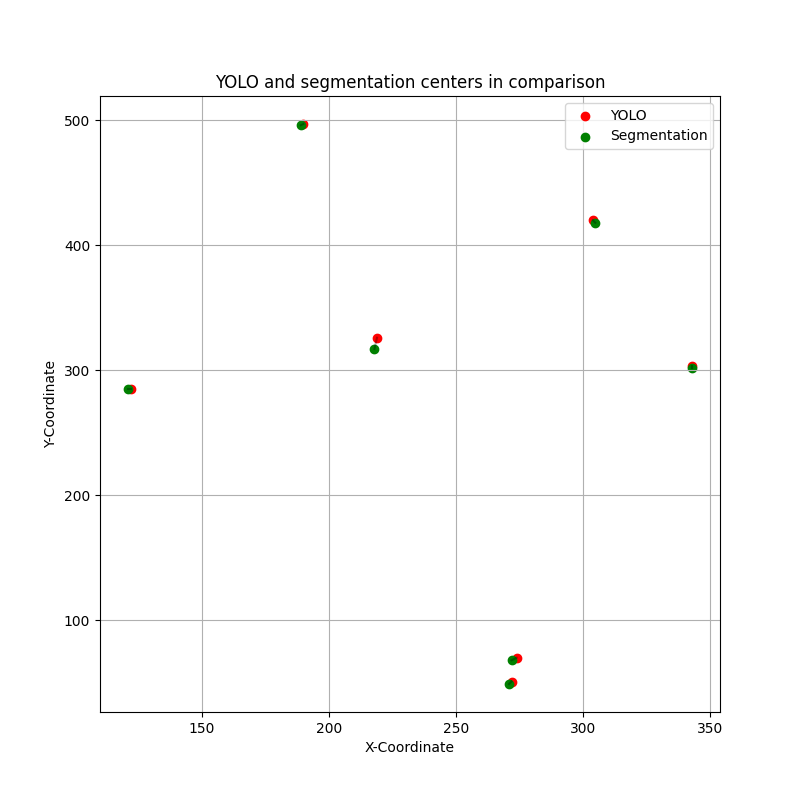
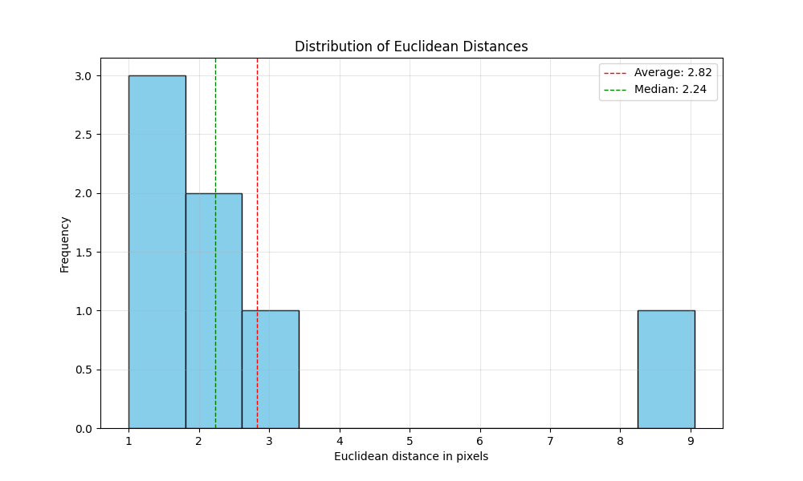

Maximilian Burger 8h

# Ball Detection and Segmentation *(Tennis Ball Example)*

This implementation is a  pipeline for tennis ball localization, segmentation, and centroid analysis.
It demonstrates how deep learning-based object detection can be used as a
preliminary step for more precise segmentation, and shows the difference between bounding box centers and true ball
centroids through statistical analysis.

## Pipeline Steps

### 1. Data Acquisition and Preparation

```python
def load_images(directory):
    images = []
    filenames = []
    for filename in os.listdir(directory):
        img = cv2.imread(os.path.join(directory, filename))
        img = cv2.cvtColor(img, cv2.COLOR_BGR2RGB)  # convert BGR to RGB
        images.append(img)
        filenames.append(filename)
    return images, filenames
```

- Images are loaded from a folder
(image source: OpenImages dataset
https://storage.googleapis.com/openimages/web/visualizer/index.html?type=detection&set=train&c=%2Fm%2F05ctyq)
- Each image is read and converted from BGR to RGB color space
- Both images and their filenames are stored for further processing

## 2. Ball Localization with YOLO

The YOLOv11n model is used to detect tennis balls in the images:

```python
def detect_balls_yolo(model, images):
    all_boxes = []
    for img in images:
        results = model(img)
        boxes = []
        for r in results:
            for box in r.boxes:
                # only look at sports balls (coco-class 32)
                if box.cls == 32:
                    x1, y1, x2, y2 = box.xyxy[0].cpu().numpy()
                    confidence = box.conf[0].cpu().numpy()
                    boxes.append({
                        'xyxy': (int(x1), int(y1), int(x2), int(y2)),
                        'conf': confidence,
                        'center': (int((x1 + x2) / 2), int((y1 + y2) / 2))
                    })
        all_boxes.append(boxes)
    return all_boxes
```

- The YOLO model specifically filters for class 32 (sports balls) in the COCO dataset
- For each detected ball, the function extracts:
  - Bounding box coordinates (x1, y1, x2, y2)
  - Detection confidence score
  - Center point of the bounding box

## 3. Ball Segmentation within Bounding Boxes

After evaluating bounding boxes, precise segmentation is performed using Hough Circle Detection
(https://theailearner.com/tag/cv2-houghcircles/):

```python
def segment_ball(image, box):
    x1, y1, x2, y2 = box['xyxy']
    roi = image[y1:y2, x1:x2]
    # dimensions
    h, w = roi.shape[:2]
    # convert to grayscale and apply Gaussian blur
    gray_roi = cv2.cvtColor(roi, cv2.COLOR_RGB2GRAY)
    blurred = cv2.GaussianBlur(gray_roi, (7, 7), 0)
    # parameters for HoughCircles depend on roi size
    min_dim = min(h, w)
    min_radius = max(min_dim // 5, 10)
    max_radius = min_dim

    # Hough Circle detection
    circles = cv2.HoughCircles(
        blurred,
        cv2.HOUGH_GRADIENT,
        dp=1.8, 
        minDist=min_dim,
        param1=100,  # sharpness of the edges
        param2=25,  # minimum number of votes to detect a circle
        minRadius=min_radius,
        maxRadius=max_radius
    )

    mask = np.zeros((h, w), dtype=np.uint8)
    circles = np.uint16(np.around(circles))
    # use the first detected circle (highest confidence)
    circle = circles[0, 0]
    center_x, center_y, radius = circle
    # draw the circle on the mask
    cv2.circle(mask, (center_x, center_y), radius, 255, -1)
    return mask
```

- The region of interest (ROI) is extracted from the original image based on the bounding box
- The ROI is converted to grayscale and blurred to reduce noise
- Hough Circle Detection parameters are adaptively set based on ROI dimensions:
  - Minimum radius: 1/5 of the smallest dimension or 10 pixels (whichever is larger)
  - Maximum radius: the size of the ROI
- A binary mask is created with the detected circle filled in


## 4. Centroid Determination

The exact center of each ball is determined using contour analysis on the segmentation mask
(https://pyimagesearch.com/2016/02/01/opencv-center-of-contour/):

```python
def find_centroid(mask):
    contours, _ = cv2.findContours(mask, cv2.RETR_EXTERNAL, cv2.CHAIN_APPROX_SIMPLE)
    if not contours:
        return None
    largest_contour = max(contours, key=cv2.contourArea)
    M = cv2.moments(largest_contour)
    if M["m00"] == 0:
        return None
    cx = int(M["m10"] / M["m00"])
    cy = int(M["m01"] / M["m00"])
    return (cx, cy)
```

- Contour detection finds the outline of the segmented ball
- Moments of the largest contour are calculated
- The centroid coordinates are derived using the formula:
  - cx = M10/M00 (x-coordinate)
  - cy = M01/M00 (y-coordinate)
- Local centroid coordinates are converted to global image coordinates

## 5. Analysis and Visualization

The `analyze_tennis_balls()` function orchestrates the pipeline and generates visualizations:

```python
def analyze_tennis_balls(directory):
    images, filenames = load_images(directory)
    print(f"Found: {len(images)} images")
    model = YOLO("yolo11n.pt")
    all_boxes = detect_balls_yolo(model, images)
    results = []
    
    # Process each image and detected ball
    for i, (img, boxes, filename) in enumerate(zip(images, all_boxes, filenames)):
        for j, box in enumerate(boxes):
            # Processing and visualization code
            # ...
            
    return results
```

For each detected ball, a 4-panel visualization is created showing:
1. The original image with YOLO bounding box and its center point
2. The segmentation mask generated by Hough Circle detection
3. The mask overlay on the original ROI
4. The original image with both center points (YOLO in red, segmentation in green)

## 6. Statistical Analysis

Statistical analysis shwos the differences between localization and segmentation centers:

```python
def statistical_analysis(results):
    distances = [result['euclidean_distance'] for result in results]

    min_distance = min(distances)
    max_distance = max(distances)
    avg_distance = sum(distances) / len(distances)

    # Median calculation
    sorted_distances = sorted(distances)
    n = len(sorted_distances)
    if n % 2 == 0:
        median_distance = (sorted_distances[n // 2 - 1] + sorted_distances[n // 2]) / 2
    else:
        median_distance = sorted_distances[n // 2]
        
    # Print statistics and create visualizations
    # ...
```

For each ball, the function calculates:
- Difference in x-coordinate between YOLO center and segmentation centroid
- Difference in y-coordinate
- Euclidean distance between the two center points

Summary statistics include:
- Minimum distance
- Maximum distance
- Average distance
- Median distance

Results are visualized through:
- A scatter plot showing all YOLO centers and segmentation centroids
- A histogram of Euclidean distances with mean and median markers

## Results

```
Found: 7 images

0: 480x640 10 persons, 1 sports ball, 1 tennis racket, 57.3ms
Speed: 2.5ms preprocess, 57.3ms inference, 1.1ms postprocess per image at shape (1, 3, 480, 640)

0: 640x640 2 persons, 1 sports ball, 1 tennis racket, 61.7ms
Speed: 1.8ms preprocess, 61.7ms inference, 0.7ms postprocess per image at shape (1, 3, 640, 640)

0: 448x640 1 dog, 1 frisbee, 1 sports ball, 48.0ms
Speed: 1.0ms preprocess, 48.0ms inference, 0.6ms postprocess per image at shape (1, 3, 448, 640)

0: 640x448 1 person, 1 sports ball, 1 tennis racket, 46.0ms
Speed: 1.7ms preprocess, 46.0ms inference, 0.8ms postprocess per image at shape (1, 3, 640, 448)

0: 640x448 1 person, 1 sports ball, 1 tennis racket, 39.2ms
Speed: 1.2ms preprocess, 39.2ms inference, 0.7ms postprocess per image at shape (1, 3, 640, 448)

0: 640x448 1 person, 1 sports ball, 44.3ms
Speed: 1.0ms preprocess, 44.3ms inference, 0.8ms postprocess per image at shape (1, 3, 640, 448)

0: 640x480 1 person, 1 sports ball, 1 tennis racket, 54.0ms
Speed: 2.1ms preprocess, 54.0ms inference, 0.7ms postprocess per image at shape (1, 3, 640, 480)

Stats:
Minimum: 1.00 Pixel
Maximum: 9.06 Pixel
Average: 2.82 Pixel
Median: 2.24 Pixel
Amount of analyzed Balls: 7
```











## Conclusion
The implementation shows that while object detection provides a good initial localization,
further segmentation can improve the precision of object centroid determination.

It's important to note that while Hough Circle Detection provides a solid first step for ball segmentation,
a more reliable and robust solution would require additional enhancements:

1. **Enhanced preprocessing**: The current implementation uses basic Gaussian blurring, but more sophisticated
preprocessing could improve edge detection:
   - Edge sharpening filters
   - Adaptive thresholding
   - Color-based preprocessing specifically tuned for tennis ball detection

2. **Alternative segmentation methods**: For scenarios with occlusion, varying lighting conditions,
or non-circular ball projections, more advanced segmentation techniques could be considered:
   - GrabCut algorithm, which could better handle complex backgrounds
   - Deep learning-based semantic segmentation for more accurate pixel-level classification