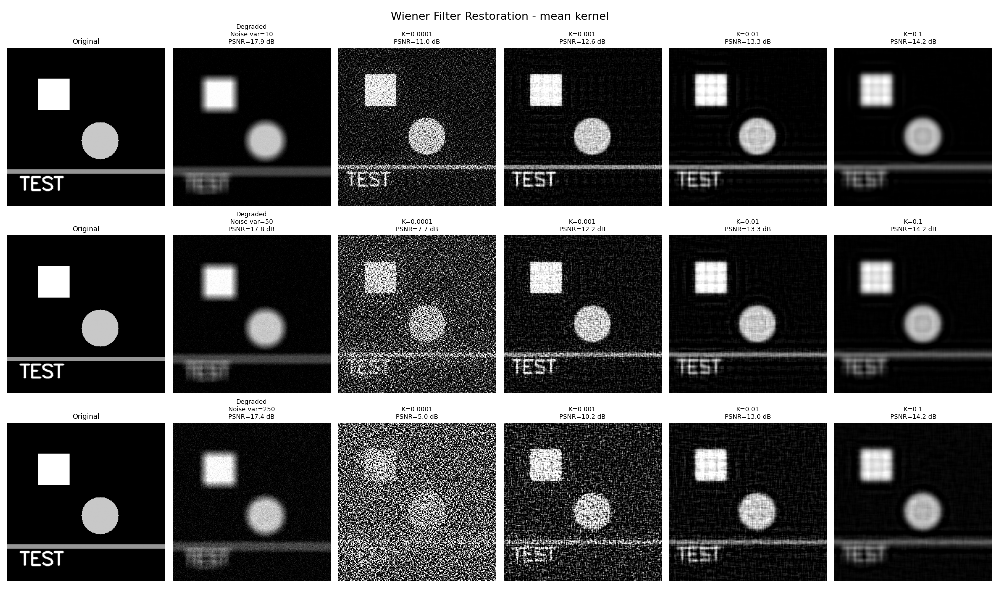
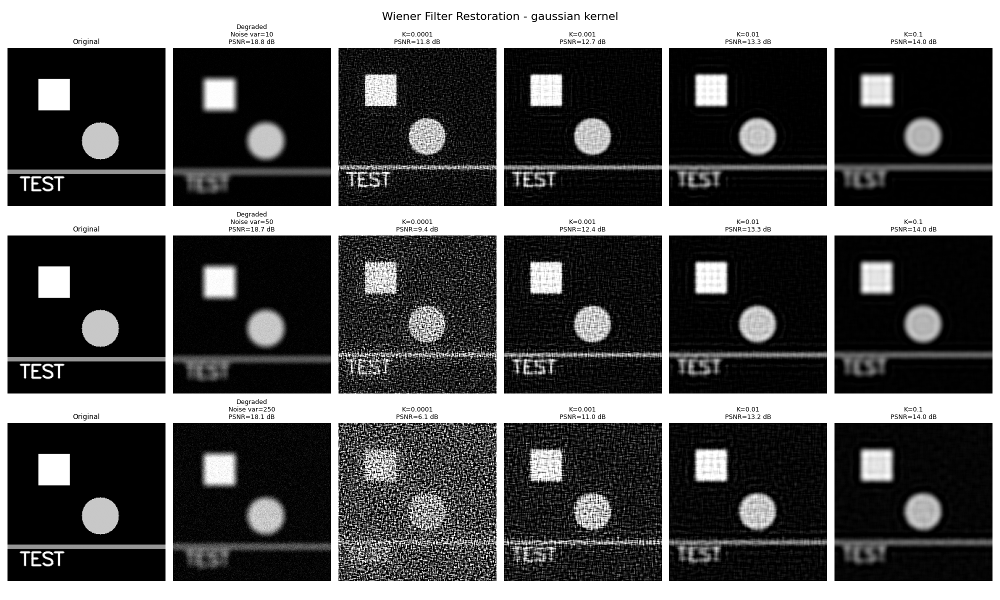
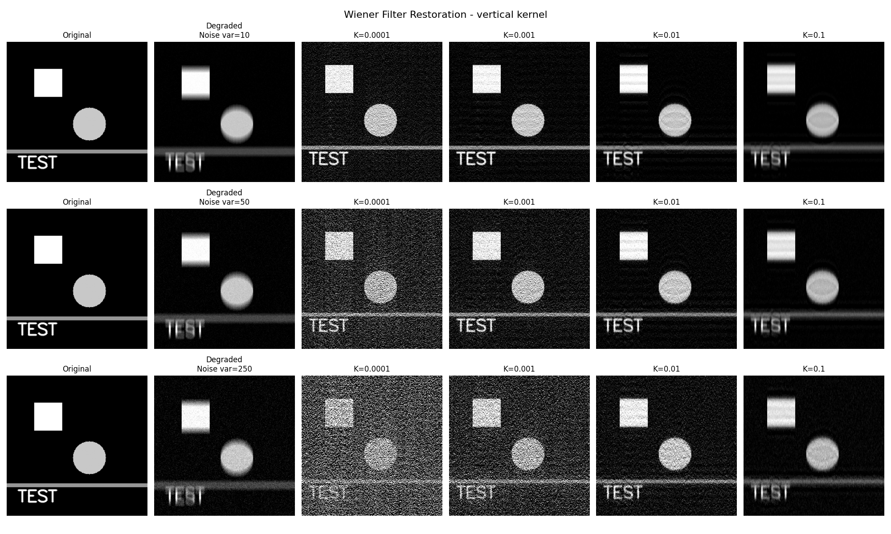
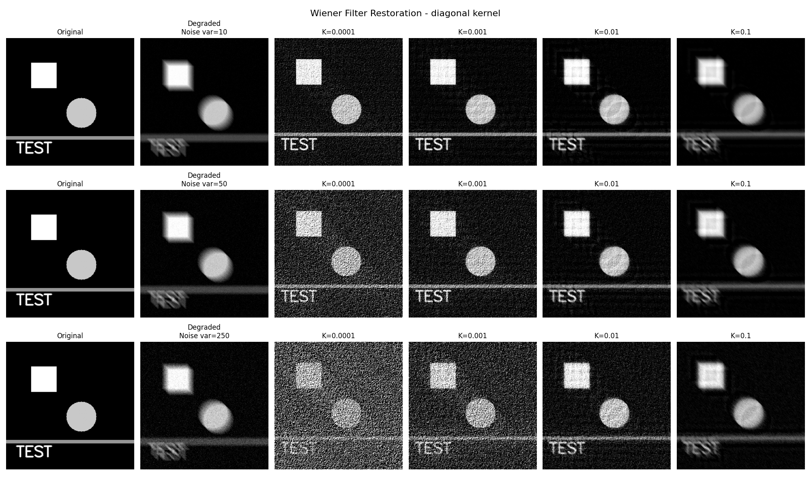
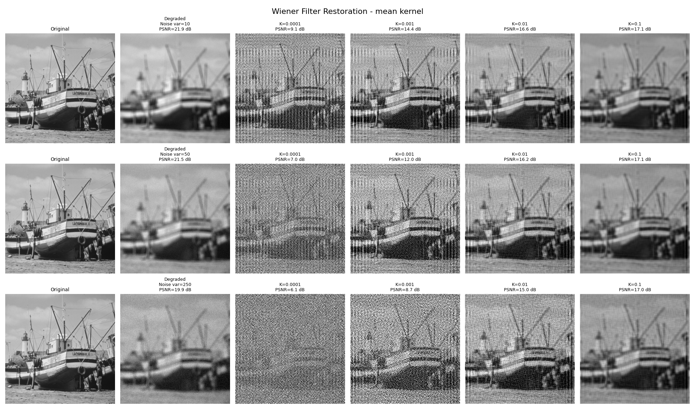
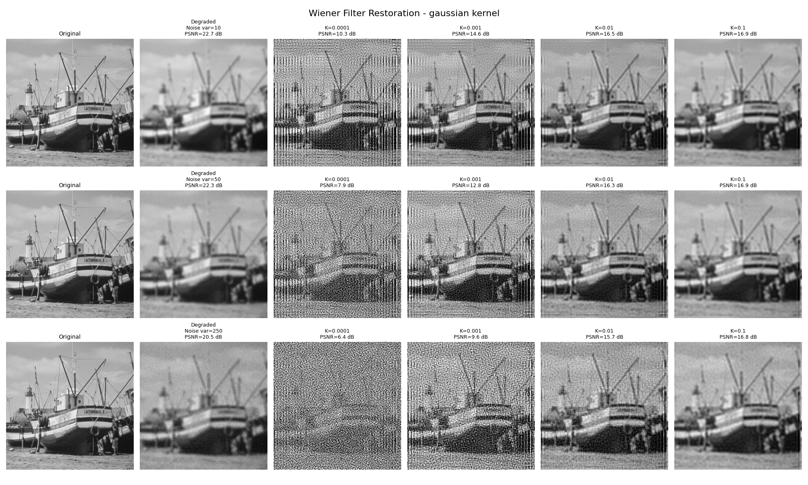
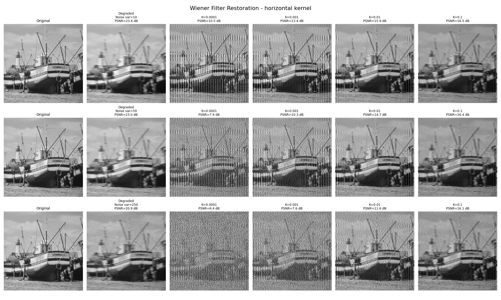
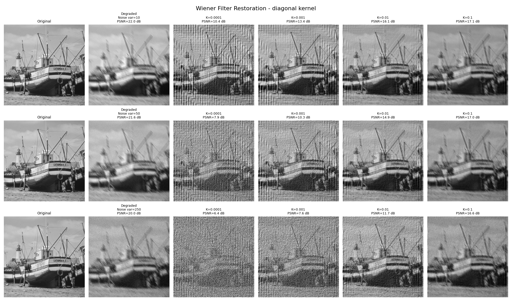
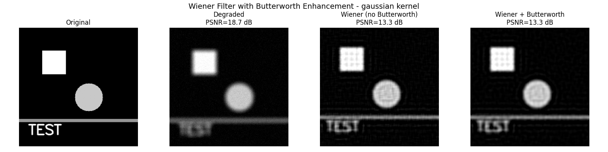
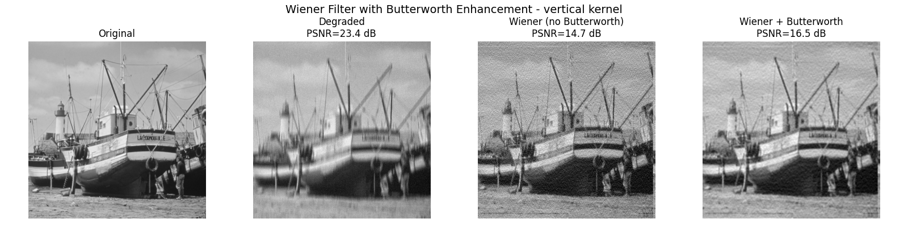

# Wiener Filter

## Core Implementation

The Wiener Filter is a procedure for image restoration, which were degraded by noise and blurring. The
basic idea is based on the following model of the image degradation:
$$
g(x,y) = f(x,y) * h(x,y) + n(x,y)
$$
where:
- $g(x,y)$ is the observed image
- $f(x,y)$ is the original image
- $h(x,y)$ is the blurring function
- $n(x,y)$ is the noise
- $*$ is the convolution operator


The Wiener filter now aims to estimate the original image $f(x,y)$ from the observed image $g(x,y)$ by
inverting the degradation process. The Wiener filter is defined as:
$$
W(u,v) = \frac{H^*(u,v)}{|H(u,v)|^2 + K}
$$
where:
- $W(u,v)$ is the Wiener filter in the frequency domain
- $H(u,v)$ is the Fourier transform of the degradation function
- $H^*(u,v)$ is the complex conjugate of $H(u,v)$
- $K$ is a regularization parameter (often related to the noise level)

After computing the Wiener filter, it can be applied in the frequency domain to the degraded image:
$$
F'(u,v) = W(u,v) * G(u,v)
$$
where:
- $F'(u,v)$ is the restored image in the frequency domain
- $W(u,v)$ is the Wiener filter
- $G(u,v)$ is the Fourier transform of the degraded image


Finally, the inverse Fourier transform is applied to obtain the restored image in the spatial domain:
$$
f(x,y) = \mathcal{F}^{-1}(F'(u,v))
$$


### Implementation

#### Methods for degrading the image

##### Creating the Kernels `create_kernels`

This implemented method creates different blurring kernels.

###### Mean Filter (Box Filter)
```python
kernels['mean'] = np.ones((kernel_size, kernel_size)) / (kernel_size * kernel_size)
```
Simple averaging filter, which replaces each pixel with the average of its neighbors.

###### Gaussian Filter
```python
sigma = kernel_size / 3.0
ax = np.arange(-kernel_size // 2 + 1., kernel_size // 2 + 1.)
xx, yy = np.meshgrid(ax, ax)
kernels['gaussian'] = np.exp(-(xx ** 2 + yy ** 2) / (2 * sigma ** 2))
```
Creates a Gaussian kernel with a standard deviation of `sigma`. The kernel is normalized to sum to 1.
For sigma 1/3 of the kernel size will be used.

###### Motion Blur
- **Horizontal**: Only the middle row of the kernel contains non-zero values.
```python
kernels['horizontal.png'] = np.zeros((kernel_size, kernel_size))
kernels['horizontal.png'][kernel_size // 2, :] = 1.0 / kernel_size
```
- **Vertical**: Only the middle column of the kernel contains non-zero values.
```python
kernels['vertical'] = np.zeros((kernel_size, kernel_size))
kernels['vertical'][:, kernel_size // 2] = 1.0 / kernel_size
```

- **Diagonal**: The main diagonal of the kernel contains non-zero values.
```python
kernels['diagonal'] = np.zeros((kernel_size, kernel_size))
np.fill_diagonal(kernels['diagonal'], 1.0 / kernel_size)
```

##### Noise addition `add_noise`
For the noise addition, a Gaussian noise is added to the image.
```python
noise = np.random.normal(0, np.sqrt(noise_variance), image.shape)
noisy_image = image + noise
return np.clip(noisy_image, 0, 255).astype(np.uint8)
```
`np.clip` is used to ensure that the pixel values are in the range [0, 255].

##### Degrading the image `degrade_image`

This method takes an image and a kernel as input, applies the kernel to the image using convolution,
and adds noise to the result.
```python
blurred = cv2.filter2D(image.astype(np.float64), -1, kernel)
degraded = self.add_noise(blurred, noise_variance)
```

#### Wiener Deconvolution `wiener_deconvolution` (Core Method)

The Wiener deconvolution is performed in the frequency domain using the Fast Fourier Transform (FFT).

The steps are as follows:

##### Step 1: Fourier Transform

The degraded input image and kernel are transformed into the frequency domain using the FFT.
```python
G = np.fft.fft2(degraded.astype(np.float64))
H = np.fft.fft2(kernel_padded)
```

##### Step 2: Conjugate of the Kernel

The conjugate of the kernel is computed.
```python
H_conj = np.conj(H)
```
This calculates $H*$ (the complex conjugate of $H$).

##### Step 3: Magnitude Squared of the Kernel
The magnitude squared of the kernel is computed.
```python
H_squared = np.abs(H) ** 2
```
This calculates $|H|^2$ (the magnitude squared of $H$).

##### Step 4: Applying the Wiener Filter

The formula for the Wiener filter is:
$$
W(u,v) = \frac{H*(u,v)}{ |H(u,v)|² + K}
\\
F'(u,v) = W(u,v) * G(u,v)
$$
where:
- $W(u,v)$ is the Wiener filter
- $F'(u,v)$ is the restored image in the frequency domain
- $K$ is the Regularization parameter (noise to signal ratio)

```python
W = H_conj / (H_squared + K + epsilon)
F_estimate = W * G
```

##### Step 5: Inverse Fourier Transform
The inverse FFT is applied to the filtered image to obtain the restored image in the spatial domain.
Only the real part of the restored image is taken, as the imaginary part should be negligible.
```python
restored = np.fft.ifft2(F_estimate)
restored = np.real(restored)
```


### Test-Pictures

To quantify the results, the PSNR (Peak Signal-to-Noise Ratio) is used. The PSNR is defined as:
$$
PSNR = 10 \cdot \log_{10} \left( \frac{MAX^2}{MSE} \right)
$$
where:
- $MAX$ is the maximum possible pixel value (255 for 8-bit images)
- $MSE$ is the mean squared error between the original and restored images

A higher PSNR value indicates a better restoration quality
-> better mathematical similarity to the original image.
Be aware that mathematical similarity does not always mean subjective visual similarity,
as the test results clearly show.













> TODO: Discuss the results

#### Additional approach with additional Butterworth-Filter `butterworth_filter`
For additional filtering, a Butterworth Lowpass-filter can be applied to the restored image.

The Butterworth filter is defined as:
$$
H(u,v) = \frac{1}{1 + \left( \frac{D(u,v)}{D_0} \right)^{2n}}
$$
where:
- $D_0$ is the cutoff frequency
- $D(u,v)$ is the distance from the origin in the frequency domain
- $n$ is the order of the filter
- $H(u,v)$ is the filter transfer function

```python
D = np.sqrt(u ** 2 + v ** 2)
H = 1 / (1 + (D / D0) ** (2 * order))
```

The Butterworth filter is combined with the Wiener filter in the method `wiener_with_butterworth`.
$$
W = W * B
$$
where:
- $W$ is the Wiener filter
- $B$ is the Butterworth filter

### Test-Pictures





