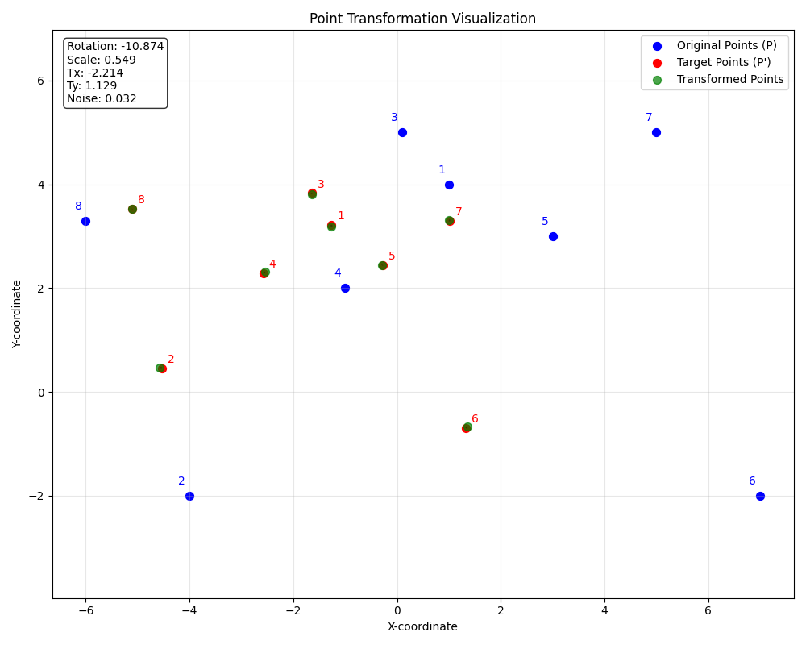

## Bibliotheken und Daten

- `numpy` für numerische Operationen und Arrays
- `scipy.optimize` für die Optimierungsfunktion `minimize`
- `math` für mathematische Funktionen wie Sinus und Kosinus
- `matplotlib.pyplot` für die Visualisierung


`P`: Die Ursprungspunkte (8 Punkte in einem 2D-Koordinatensystem)
`P_prime`: Die Zielpunkte, zu denen die Ursprungspunkte transformiert werden sollen

## Die Transformationsfunktion
Die Funktion `transformation_error` ist der Hauptteil des Codes.

Parameter:
- `theta`: Der Rotationswinkel
- `s`: Der Skalierungsfaktor
- `tx`, `ty`: Die Translationskomponenten (Verschiebung in x- und y-Richtung)


Die Transformation wird auf jeden Punkt in `P` angewendet:

Rotation: Die Punkte werden um den Ursprung mit dem Winkel `theta` gedreht
Skalierung: Die Punkte werden mit dem Faktor `s` skaliert
Translation: Die Punkte werden um `tx` in x-Richtung und `ty` in y-Richtung verschoben


Danach wird der mittlere quadratische Fehler zwischen den transformierten Punkten und
den Zielpunkten `P_prime` berechneter. Dieser Fehler ist das Maß dafür, wie gut die
Transformation die Ursprungspunkte an die Zielpunkte anpasst hat.

## Die Optimierung
Mit der Funktion `minimize` aus der SciPy-Bibliothek werden die optimalen
Transformationsparameter ermittelt:

Ein Startpunkt `initial_guess` wird festgelegt mit:
- Rotationswinkel = 0
- Skalierungsfaktor = 1
- Verschiebung = (0, 0)

_(keine Veränderung)_

Die `minimize`-Funktion verwendet die Nelder-Mead-Methode (ein direkter Suchalgorithmus),
um die Parameter zu finden, die den mittleren quadratischen Fehler minimieren.
Das Ergebnis wird in `result` gespeichert und die ermittelten optimalen Parameter
werden extrahiert:

- `opt_theta`: Optimaler Rotationswinkel
- `opt_scale`: Optimaler Skalierungsfaktor
- `opt_tx`, `opt_ty`: Optimale Verschiebungen

## Fehleranalyse
Nach der Optimierung:
Der verbleibende Fehler `residual_error` wird ermittelt (der minimierte und verbleibende Fehler)
Daraus wird das Rauschen `noise` berechnet (als Wurzel des mittleren quadratischen Fehlers)

Neuberechnung der transformierten Punkte:
Mit den optimalen Parametern werden die Ursprungspunkte erneut transformiert:

- Für jeden Punkt in `P` wird die optimale Transformation angewendet
- Die transformierten Punkte werden in `transformed_P` gespeichert
- Für jeden Punkt wird der individuelle Fehler (Abstand zum Zielpunkt) berechnet und ausgegeben

Visualisierung:
Abschließend wird eine Visualisierung erstellt.

## Zusammenfassung
Zusammenfassung der mathematischen Transformation
Die angewendete Transformation ist eine Kombination aus:

- Rotation um den Ursprung um den Winkel `theta`
- Skalierung vom Ursprung aus mit dem Faktor `s`
- Translation um den Vektor (`tx`, `ty`)

Die mathematische Formel für die Transformation eines Punktes (x, y) lautet:
```
x' = s * (x * cos(theta) - y * sin(theta)) + tx
y' = s * (x * sin(theta) + y * cos(theta)) + ty
```

Der Code bestimmt die Parameter `theta`, `s`, `tx` und `ty` so, dass der durchschnittliche
quadratische Abstand zwischen den transformierten Punkten und den Zielpunkten minimal wird.

```
Optimal scale: 0.5489
Optimal translation Tx: -2.2145
Optimal translation Ty: 1.1295
Estimated noise level: 0.0316

Point-wise errors:
Point 1: 0.0404
Point 2: 0.0455
Point 3: 0.0175
Point 4: 0.0436
Point 5: 0.0124
Point 6: 0.0359
Point 7: 0.0242
Point 8: 0.0064
```

