Maximilian Burger [7h]

# Task 1
This program detects moving objects in a video by comparing each frame against a
background model.

## Stage 1 Background Model Creation
- The algorithm collects the first 30 frames of the video
- These frames are converted to grayscale and blurred to reduce noise
- The background model is created by computing the median across all collected frames
- This median-based approach ensures that moving objects appearing in
some initial frames don't become part of the background

## Stage 2 Detection and Processing Loop

For each frame in the video:
1. **Frame Preprocessing:** Convert the current frame to grayscale and apply
gausian blur to reduce noise sensitivity
2. **Motion Detection:**
   - Calculate the absolute difference between the current frame and the background model
   - Apply a threshold (value 25) to identify areas with significant changes
   - These areas represent potential moving objects
3. **Heatmap Update:**
   - Add the current binary motion mask to the cumulative heat map
4. **Background Model Update:**
   - Update the background model only in areas where no motion is detected
   - The selective update prevents moving objects that temporarily stop from
   being taken account into the background
   - The learning rate (0.01) controls how quickly the background adapts to scene changes
5. **Visualization:**
   - Display original video, current Background model, Binary mask and Heatmap

## Implementation

```python
from time import sleep

import cv2
import numpy as np
import os


def main():
    # Input video (0 = webcam)
    video_path = "./vtest.avi"

    bg_learning_frames = 30  # Number of frames to use for initial background model
    bg_learning_rate = 0.01  # Background update rate (0-1)
    motion_threshold = 25  # Threshold for motion detection

    # Create output directory if it doesn't exist
    output_dir = "img/task1"
    os.makedirs(output_dir, exist_ok=True)

    # Initialize video capture
    cap = cv2.VideoCapture(video_path)
    if not cap.isOpened():
        print('Unable to open video source')
        return

    frame_count = 0
    frame_buffer = []

    print("First stage: collect frames for background initialization")
    while frame_count < bg_learning_frames:
        ret, frame = cap.read()
        if not ret:
            break

        gray_frame = cv2.cvtColor(frame, cv2.COLOR_BGR2GRAY)
        gray_frame = cv2.GaussianBlur(gray_frame, (21, 21), 0)
        frame_buffer.append(gray_frame)
        frame_count += 1

    # Reset video
    cap.set(cv2.CAP_PROP_POS_FRAMES, 0)
    frame_count = 0

    # Create initial background model by median filtering the buffer
    if len(frame_buffer) > 0:
        background = np.median(np.array(frame_buffer), axis=0).astype(np.float32)
        print(f"Background model created from {len(frame_buffer)} frames")
    else:
        print("Error: Could not initialize background model")
        return

    # Initialize heat map
    heat_map = np.zeros_like(frame_buffer[0], dtype=np.float32)

    print("Second stage: process video with the initialized background")
    while True:
        ret, frame = cap.read()
        if not ret:
            break

        # Make a copy of the frame and convert to grayscale for processing
        gray_frame = cv2.cvtColor(frame, cv2.COLOR_BGR2GRAY)
        gray_frame = cv2.GaussianBlur(gray_frame, (21, 21), 0)

        # Calculate absolute difference between background and current frame
        frame_delta = cv2.absdiff(background.astype("uint8"), gray_frame)

        # Threshold the delta image to get binary mask of moving areas
        thresh = cv2.threshold(frame_delta, motion_threshold, 255, cv2.THRESH_BINARY)[1]

        # Update heat map (accumulate motion intensity)
        heat_map = heat_map + thresh.astype(np.float32) / 255.0

        # Update background model
        # Check if the pixel is not part of a detected motion (to prevent including moving objects)
        mask = 255 - thresh # Invert
        if bg_learning_rate > 0:
            # Only update pixels that are not part of detected motion
            cv2.accumulateWeighted(gray_frame, background, bg_learning_rate, mask=mask)

        # Prepare visualization frames
        background_display = background.astype("uint8")

        # Create mask overlay on original frame
        overlay = frame.copy()
        # Create a red mask where motion is detected
        red_mask = np.zeros_like(frame)
        red_mask[thresh == 255] = [0, 0, 255]  # BGR => red
        # Add the red mask to the original frame with transparency
        alpha = 0.5  # Transparency factor
        mask_overlay = cv2.addWeighted(overlay, 1, red_mask, alpha, 0)

        # Normalize heat map for visualization
        if np.max(heat_map) > 0:
            # Scale values to use full range (0-255)
            normalized_heat_map = heat_map / np.max(heat_map) * 255
            # Convert to 8-bit unsigned integer format
            normalized_heat_map = np.uint8(normalized_heat_map)
        else:
            # If no motion detected yet, create an empty image
            normalized_heat_map = np.zeros_like(heat_map, dtype=np.uint8)

        heat_map_display = cv2.applyColorMap(normalized_heat_map, cv2.COLORMAP_JET)

        cv2.imshow("Original Frame", frame)
        cv2.imshow("Background Model", background_display)
        cv2.imshow("Binary Motion Mask", thresh)
        cv2.imshow("Heat Map", heat_map_display)
        cv2.imshow("Mask Overlay", mask_overlay)

        frame_count += 1

        # Exit on 'q' press
        key = cv2.waitKey(30) & 0xFF
        if key == ord('q'):
            break

    # Save
    original_path = f"{output_dir}/{os.path.splitext(os.path.basename(video_path))[0]}_original.jpg"
    background_path = f"{output_dir}/{os.path.splitext(os.path.basename(video_path))[0]}_background.jpg"
    thresh_path = f"{output_dir}/{os.path.splitext(os.path.basename(video_path))[0]}_threshold.jpg"
    heat_map_path = f"{output_dir}/{os.path.splitext(os.path.basename(video_path))[0]}_heat_map.jpg"
    mask_path = f"{output_dir}/{os.path.splitext(os.path.basename(video_path))[0]}_mask.jpg"

    cv2.imwrite(original_path, frame)
    cv2.imwrite(background_path, background_display)
    cv2.imwrite(thresh_path, thresh)
    cv2.imwrite(heat_map_path, heat_map_display)
    cv2.imwrite(mask_path, mask_overlay)

    # Clean up
    cap.release()
    cv2.destroyAllWindows()


if __name__ == "__main__":
    main()
```

## Sample

Original
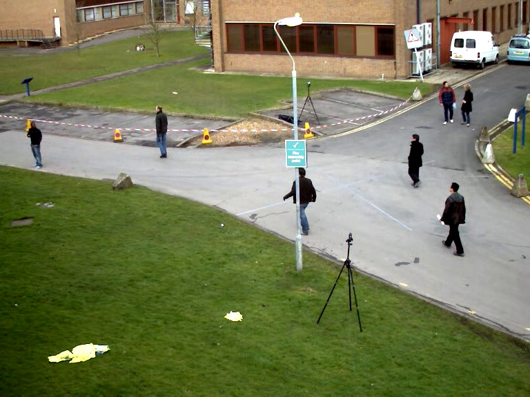
Background
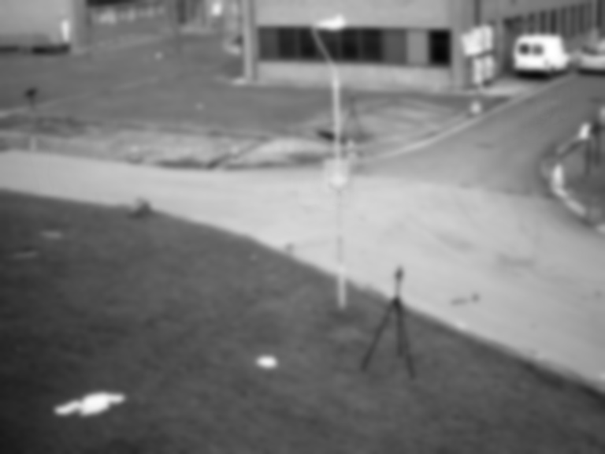
Movement Map
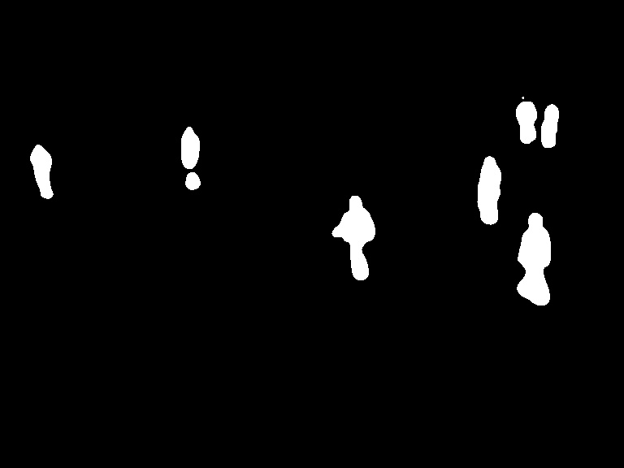
Overlay
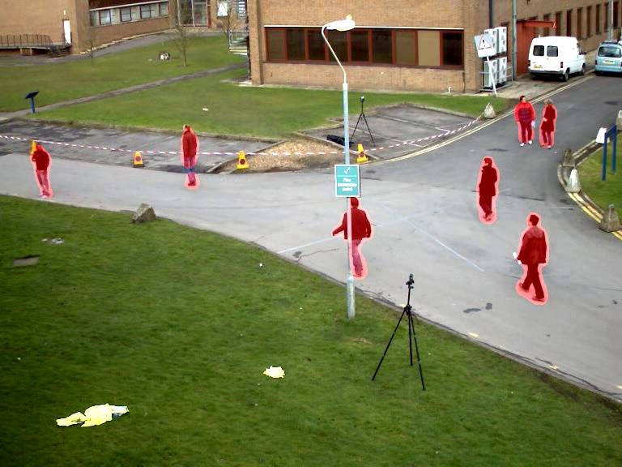
Heatmap
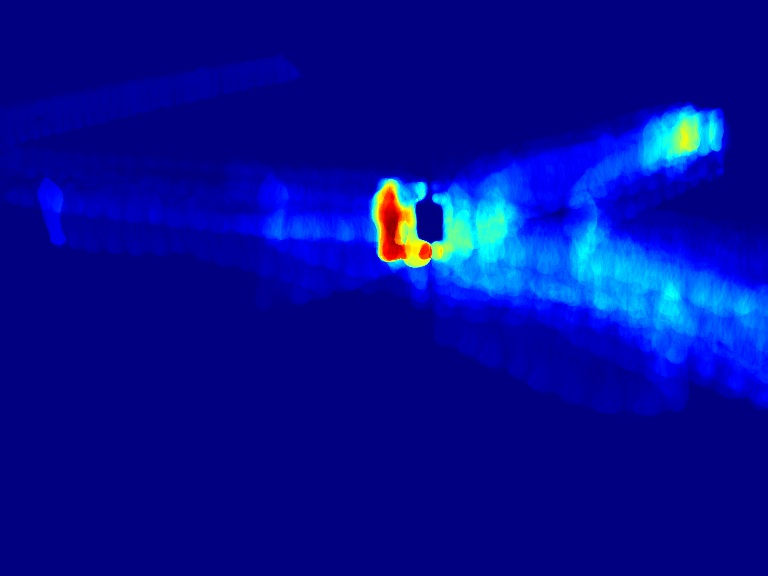

# Task2

Task 2 is the implementation and analysis of different OpenCV background subtractor algorithms for
detecting moving objects in video.

## Background Subtractor Algorithms
OpenCV provides several background subtraction algorithms, each with different characteristics:

### MOG2 (Mixture of Gaussians)
Models each background pixel as a mixture of Gaussian distributions

Special Feature: Adaptive to varying lighting conditions
Parameters:
- `history`: Number of frames that affect the background model
- `varThreshold`: Threshold for foreground detection
- `detectShadows`: Option to detect and mark shadows

### KNN (K-Nearest Neighbors)

Uses K nearest neighbors to classify pixels as foreground or background
Good for scenes with dynamic backgrounds (like moving gras)
Parameters:
- `history`: Number of frames for background model
- `dist2Threshold`: Threshold for foreground detection
- `detectShadows`: Option to detect shadows

### CNT (Count-based)
Uses a counting-based approach to determine background
Special Feature: Faster but potentially less accurate than statistic models
Parameters:
- `minPixelStability`: Minimum frames for pixel stability
- `useHistory`: Whether to use history model
- `maxPixelStability`: Maximum frames for pixel stability

### GMG (Godbehere-Matsukawa-Goldberg)
Combines statistical background image estimation with Bayesian segmentation
Good at handling lighting changes
Parameters:
- `initializationFrames`: Number of frames for initialization
- `decisionThreshold`: Threshold for foreground detection


## Handling Stationary Objects
- `MOG2` and `KNN` gradually include stationary objects into the background based on the `history` parameter
- `CNT` includes stationary objects after `minPixelStability` frames
- `GMG` tends to keep detecting stationary objects longer than other methods
   - Higher `decisionThreshold`  values make `GMG` even more resistant to incorporating stationary objects

## Implementation
```python
import cv2
import numpy as np
import os


def main():
    # Input video (0 = webcam)
    video_path = "./vtest.avi"

    # Create output directory if it doesn't exist
    output_dir = "img/task2"
    os.makedirs(output_dir, exist_ok=True)

    # Activate Erosion and Dilatation
    apply_morphology = False  # Set True to activate Erosion and Dilatation Post-Processing
    kernel_size = 3
    kernel = np.ones((kernel_size, kernel_size), np.uint8)
    erosion_iterations = 1
    dilation_iterations = 2

    cap = cv2.VideoCapture(video_path)
    width = int(cap.get(cv2.CAP_PROP_FRAME_WIDTH))
    height = int(cap.get(cv2.CAP_PROP_FRAME_HEIGHT))

    # OpenCV background subtractors
    subtractors = {
        'MOG2': cv2.createBackgroundSubtractorMOG2(
          history=90,  # Number of frames for background model
          varThreshold=25,  # Threshold for foreground detection
          detectShadows=False  # Don't detect shadows (faster)
        ),
        'KNN': cv2.createBackgroundSubtractorKNN(
          history=90,  # Number of frames for background model
          dist2Threshold=1000.0,  # Threshold for foreground detection
          detectShadows=False  # Don't detect shadows (faster)
        ),
         'CNT': cv2.bgsegm.createBackgroundSubtractorCNT(
           minPixelStability=10,  # Min frames for pixel stability
           useHistory=True,  # Use history model
           maxPixelStability=15 * 60  # Max frames for pixel stability
         ),
        'GMG': cv2.bgsegm.createBackgroundSubtractorGMG(
            initializationFrames=30,  # Frames for initialization
            decisionThreshold=0.85  # Threshold for foreground detection
        )
    }

    # Initialize heat maps for each subtractor
    heat_maps = {name: np.zeros((height, width), dtype=np.float32)
                 for name in subtractors.keys()}

    # Dictionaries to store mask overlays for each subtractor
    mask_overlays = {name: None for name in subtractors.keys()}

    print("Processing video with different background subtractors...")
    while True:
        ret, frame = cap.read()
        if not ret:
            break

        # Process each subtractor
        for name, subtractor in subtractors.items():
            # Apply background subtraction to get foreground mask
            fg_mask = subtractor.apply(frame)

            # Apply Erosion and Dilatation, if activated
            if apply_morphology:
                # Reduce noise with Erosion
                fg_mask = cv2.erode(fg_mask, kernel, iterations=erosion_iterations)
                # Fill gaps with Dilatation
                fg_mask = cv2.dilate(fg_mask, kernel, iterations=dilation_iterations)

            # Update heat map
            heat_maps[name] += fg_mask.astype(np.float32) / 255.0

            # Normalize heat map for visualization
            if np.max(heat_maps[name]) > 0:
                normalized_heat_map = heat_maps[name] / np.max(heat_maps[name]) * 255
                normalized_heat_map = np.uint8(normalized_heat_map)
            else:
                normalized_heat_map = np.zeros_like(heat_maps[name], dtype=np.uint8)

            heat_map_display = cv2.applyColorMap(normalized_heat_map, cv2.COLORMAP_JET)

            # Create mask overlay on original frame
            overlay = frame.copy()
            # Create a red mask where motion is detected
            red_mask = np.zeros_like(frame)
            red_mask[fg_mask == 255] = [0, 0, 255]  # BGR => red
            # Add the red mask to the original frame with transparency
            alpha = 0.5
            mask_overlay = cv2.addWeighted(overlay, 1, red_mask, alpha, 0)

            # Store the current mask overlay
            mask_overlays[name] = mask_overlay

            # Show results for this subtractor
            cv2.imshow(f"{name} - Binary Motion Mask", fg_mask)
            cv2.imshow(f"{name} - Heat Map", heat_map_display)
            cv2.imshow(f"{name} - Mask Overlay", mask_overlay)

        cv2.imshow(f"Original Frame", frame)

        # Exit on 'q' press
        key = cv2.waitKey(30) & 0xFF
        if key == ord('q'):
            break

    # Save final heat maps and mask overlays as images
    for name, heat_map in heat_maps.items():
        if np.max(heat_map) > 0:
            normalized_heat_map = heat_map / np.max(heat_map) * 255
            normalized_heat_map = np.uint8(normalized_heat_map)
        else:
            normalized_heat_map = np.zeros_like(heat_map, dtype=np.uint8)

        heat_map_color = cv2.applyColorMap(normalized_heat_map, cv2.COLORMAP_JET)

        heat_map_path = f"{output_dir}/{os.path.splitext(os.path.basename(video_path))[0]}_{name}_heatmap_morph.png"
        cv2.imwrite(heat_map_path, heat_map_color)
        print(f"Saved heat map: {heat_map_path}")

        # Save the last mask overlay for each subtractor
        mask_overlay_path = f"{output_dir}/{os.path.splitext(os.path.basename(video_path))[0]}_{name}_overlay_morph.png"
        cv2.imwrite(mask_overlay_path, mask_overlays[name])
        print(f"Saved mask overlay: {mask_overlay_path}")

    # Clean up
    cap.release()
    cv2.destroyAllWindows()


if __name__ == "__main__":
    main()
```

## Results
Algorithm: `CNT`
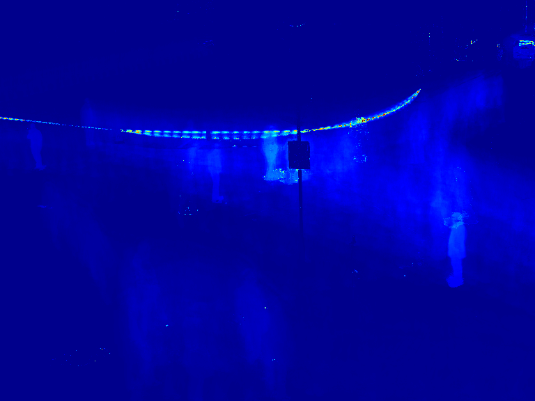
Algorithm: `CNT` *with morphological post-processing*
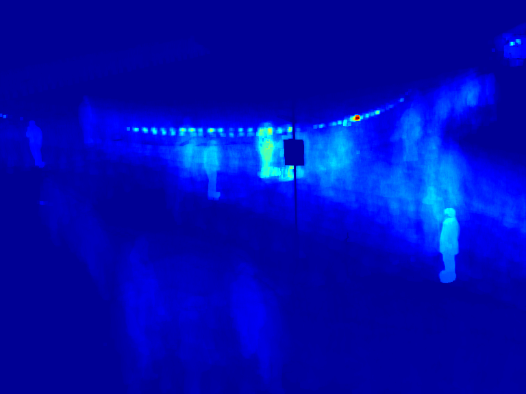
Algorithm: `CNT`
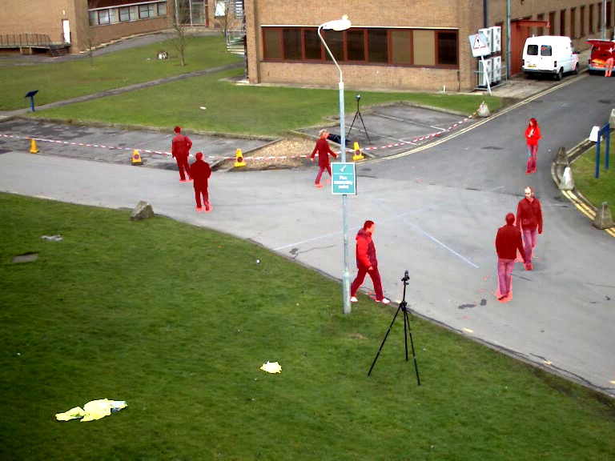
Algorithm: `CNT` *with morphological post-processing*

Algorithm: `GMG`

Algorithm: `GMG` *with morphological post-processing*
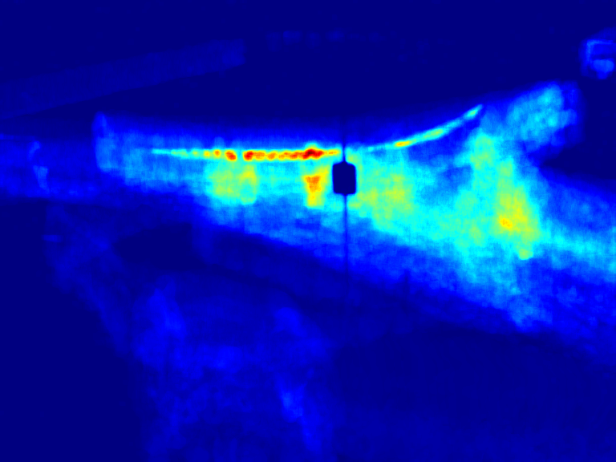
Algorithm: `GMG`

Algorithm: `GMG` *with morphological post-processing*
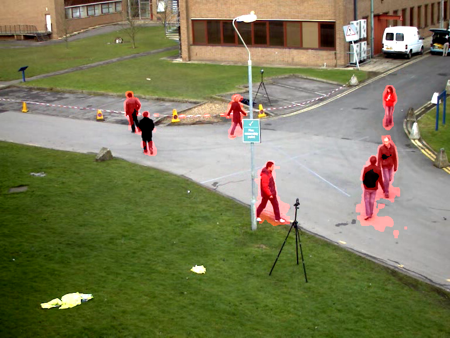
Algorithm: `KNN`
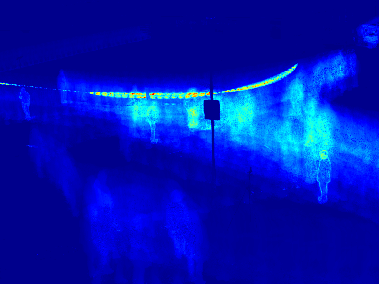
Algorithm: `KNN` *with morphological post-processing*
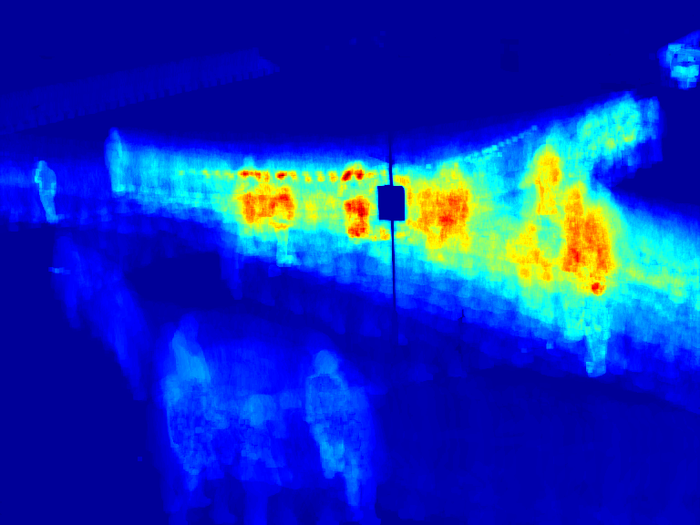
Algorithm: `KNN`
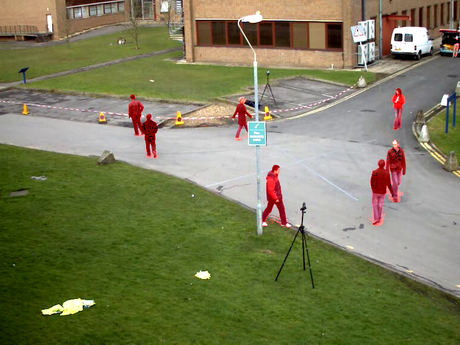
Algorithm: `KNN` *with morphological post-processing*

Algorithm: `MOG2`
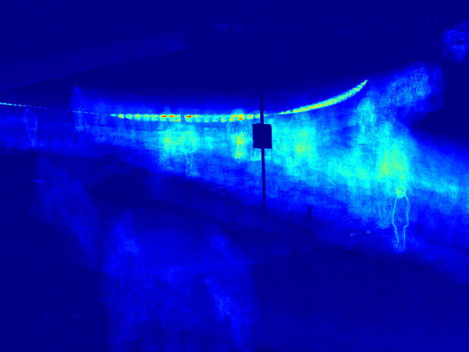
Algorithm: `MOG2` *with morphological post-processing*
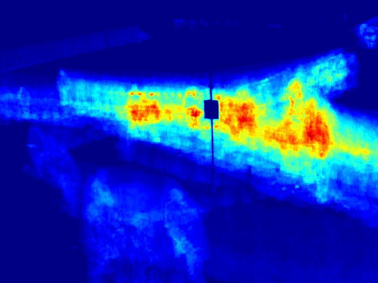
Algorithm: `MOG2`

Algorithm: `MOG2` *with morphological post-processing*


## Conclusions and Recommendations

Best Performer for the given Test Video: `CNT` demonstrated the best overall performance for our specific
test video (`vtest.avi`). Its counting-based approach provided cleaner masks with fewer false positives
than the probabilistic models.

Post-Processing Necessity: All OpenCV background subtractors benefit significantly from post-processing operations.
The raw output masks all contain noise and fragmented detections that need to be refined.

Morphological Operations: The implementation of erosion and dilation showed:
- Erosion (with kernel size 3 and 1 iteration) effectively removed small noise pixels
- Dilation (with kernel size 3 and 2 iterations) helped fill gaps within detected objects 
and connect fragmented detections

Those simple morphological operations are a step in the right direction, but are clearly not
sufficient for a final post-processing pipeline.

# Task 3
~ skipped :D ~
