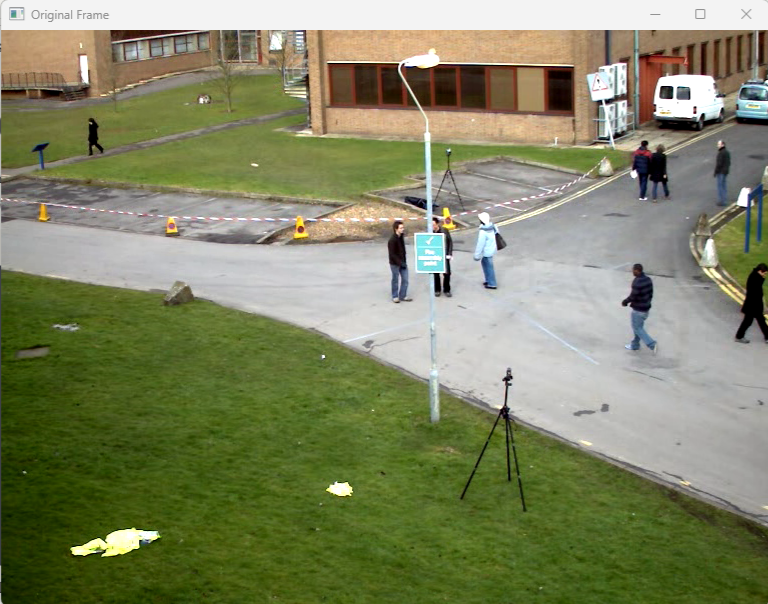
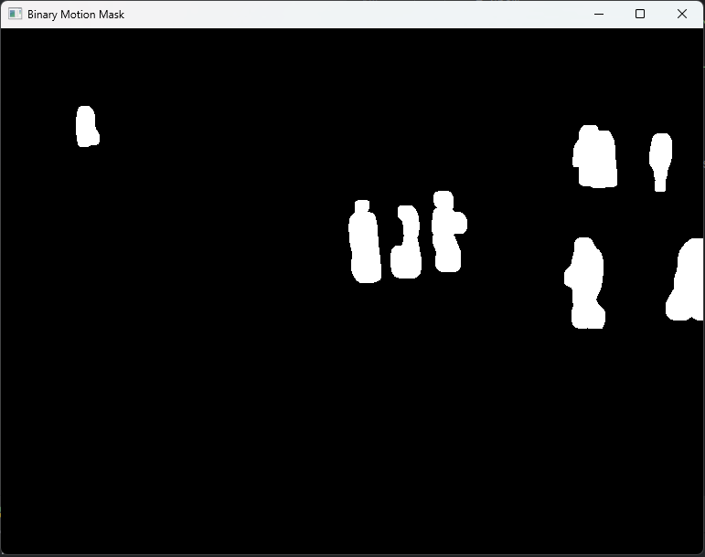
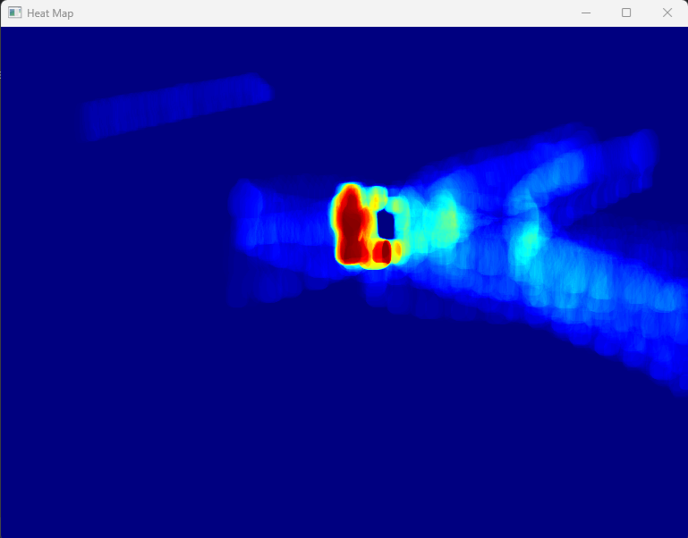

# Task 1
This program detects moving objects in a video by comparing each frame against a
background model.

## Stage 1 Background Model Creation
- The algorithm collects the first 30 frames of the video
- These frames are converted to grayscale and blurred to reduce noise
- The background model is created by computing the pixel-by-pixel median across
all collected frames
- This median-based approach ensures that moving objects appearing in
some initial frames don't become part of the background

## Stage 2 Detection and Processing Loop

For each frame in the video:
1. **Frame Preprocessing:** Convert the current frame to grayscale and apply
gausian blur to reduce noise sensitivity
2. **Motion Detection:**
   - Calculate the absolute difference between the current frame and the background model
   - Apply a threshold (value 25) to identify areas with significant changes
   - These areas represent potential moving objects
3. **Noise Reduction:**
   - Apply erosion to remove small noise spots (kernel size 2×2)
   - Apply dilation to fill gaps and connect fragmented motion areas (kernel size 5×5)
4. **Heatmap Update:**
   - Add the current binary motion mask to the cumulative heat map
5. **Background Model Update:**
   - Update the background model only in areas where no motion is detected
   - The selective update prevents moving objects that temporarily stop from
   being taken account into the background
   - The learning rate (0.01) controls how quickly the background adapts to scene changes
6. **Visualization:**
   - Display original video, current Background model, Binary mask and Heatmap

