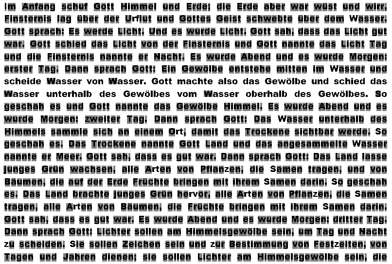
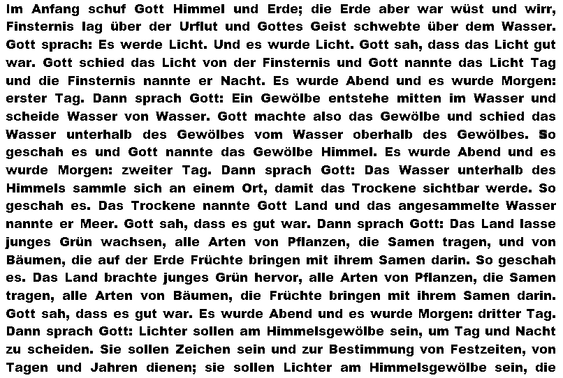
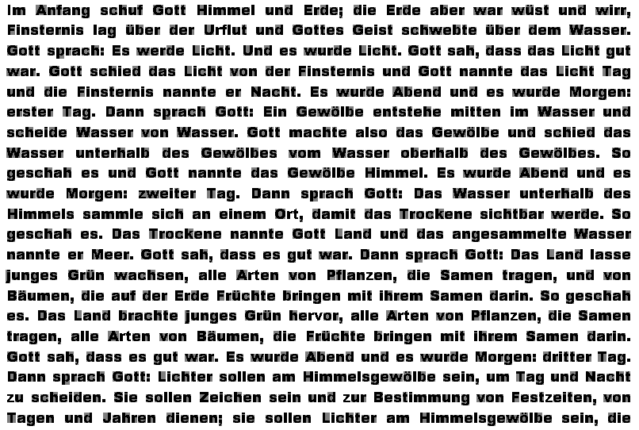

# OCR from scratch

_Maximilian Burger_\
_Lucas Hünniger_

## Table of Contents
- [Task 1](#task-1)
  - [Solution idea](#solution-idea)
  - [Implementation](#implementation)
  - [Testing](#testing)
  - [Test Run](#test-run)
  - [Interpreations & Limitations](#interpreations--limitations)
- [Task 2](#task-2)
  - [Implementation](#implementation-1)
  - [Testing](#testing-1)
  - [Test Run](#test-run-1)
  - [Interpreations & Limitations](#interpreations--limitations-1)

## Task 1

### Solution idea

The basic idea as well as some code snippets was given during the lecture.

To implement an own OCR you generally have to do:
1. Binarize the input image
2. Separate text into lines and characters
3. Extract features from characters
4. Compare features to identify matching characters
5. Mark matching characters in the output image

### Implementation

For the binarization, the image is converted to binary (black / white) using some color threshold (e. g. `127`) to distinct between background and foreground.

#### Text Separation

> Showing the code examples here would be a bit overwhelming. Just look in [OCRanalysis.py](./OCRanalysis.py).

To separate the text lines, the whole image is analyzed horizontally to identify text lines by detecting rows of foreground pixels.
If no foreground pixel is found, we have to create a new line. This behaviour is defined in the function `split_characters()`.

Using the Fire-Through technique, the single lines are then further splitted in to characters. This is defined in the function `split_characters_vertically()`. 

To have some interface for each character, the class [`SubImageRegion`](./SubImageRegion.py) is defined. 

```python
class SubImageRegion:
    def __init__(self, startX, startY, width, height, origImgArr):
        self.startX = startX
        self.startY = startY
        self.width = width
        self.height = height
        self.subImgArr = np.array([[0] * width for _ in range(height)])

        for x in range(width):
            for y in range(height):
                if 0 <= (y + startY) < len(origImgArr) and 0 <= (x + startX) < len(origImgArr[0]):
                    self.subImgArr[y][x] = origImgArr[y + startY][x + startX]
                else:
                    print(f"Warning: Coordinates ({x + startX}, {y + startY}) are out of bounds for the original image.")
```

#### Features

> Showing the code examples here would be a bit overwhelming. Just look in [ImageFeatures.py](./ImageFeatures.py).

TODO: maybe explain some selected features like Circularity a bit more + add code?

Like said in the task, we just implemented each feature that was outcommented. All the features can be found in [ImageFeatures.py](./ImageFeatures.py). In this task, the following features were used:
- Pixel Count: Total number of foreground pixels
- Maximum X/Y Dimensions: Width and height of the character region
- Centroid-Based Measurements:
  - Average distance of pixels to the centroid
  - Maximum distance of pixels to the centroid
  - Minimum distance of pixels to the centroid
- Character Circularity: Measurement of how circular the character shape is
- Relative Centroid Positions: Position of the character's center relative to its bounding box

#### Reference Character Selection

The selection of the reference character (the character that should be matched) is just defined by setting the x and y coordinate of the character you want in the image. (zero-based; the spaces between words are not count)

In the future this could be improved to make the image clickable to select one or multiple characters visually.

For this, flags were defined in [OCRanalysis.py](./OCRanalysis.py) that are passed into the `run()` method later:

```python
parser.add_argument("--row", "-r", type=int, default=1, 
                    help="Row of target character (0-based) -> default: 1")
parser.add_argument("--column", "-c", type=int, default=3,
                    help="Column of target character (0-based) -> default: 3")
```

### Testing
The testing happens in [main.py](./main.py).

For testing purposes all possible characters and special characters were extracted from the given image. They should be given using this form:

```python
characters = [
...
# row, column, expected symbol, expected count, out file name for seeing the result
(0,    56,     ",",             16,             "marked_comma.png"),
...
]
```

During the test run each result of a character analyzation is printed with the described data and an image is saved in the before defined out file path:

```python
for (row, col, letter, expected_count, out_img_path) in characters:
    full_out_img_path = os.path.join(out_img_dir, out_img_path)

    actual_count = myAnalysis.run(img_path, full_out_img_path, row, col, threshold, shrink_chars=True)
    result = "OK" if actual_count == expected_count else "ERROR"
    print(f"Letter: \'{letter}\', Expected Count: {expected_count}, Actual Count: {actual_count}, Result: {result}")
```

At the end we generate an image with all characters overlapped to see what characters were detected more than once falsely. You can see the file [here](./merged_overlay.png).

```python
image_files = [f for f in os.listdir(out_img_dir)]

base_image_path = os.path.join(out_img_dir, image_files[0])
result_image = cv2.imread(base_image_path, cv2.IMREAD_GRAYSCALE)

for image_file in image_files[1:]:
    image_path = os.path.join(out_img_dir, image_file)
    image = cv2.imread(image_path, cv2.IMREAD_GRAYSCALE)

    result_float = result_image.astype(float) / 255.0
    image_float = image.astype(float) / 255.0

    result_float = result_float * image_float

    result_image = (result_float * 255.0).astype(np.uint8)

cv2.imwrite(merged_img_path, result_image)
```

For running the test for task 1 just set the following flags:

```python
shrink_chars=False
only_use_simple_features=True
```

### Test Run

Console Output:

```plaintext
OCR Analysis Results with threshold 0.998:
Letter: ',', Expected Count: 16, Actual Count: 16, Result: OK
Letter: '.', Expected Count: 20, Actual Count: 18, Result: ERROR
Letter: ':', Expected Count: 8, Actual Count: 8, Result: OK
Letter: ';', Expected Count: 2, Actual Count: 2, Result: OK
Letter: 'A', Expected Count: 7, Actual Count: 7, Result: OK
Letter: 'B', Expected Count: 3, Actual Count: 3, Result: OK
Letter: 'D', Expected Count: 8, Actual Count: 8, Result: OK
Letter: 'E', Expected Count: 8, Actual Count: 8, Result: OK
Letter: 'F', Expected Count: 6, Actual Count: 6, Result: OK
Letter: 'G', Expected Count: 23, Actual Count: 19, Result: ERROR
Letter: 'H', Expected Count: 5, Actual Count: 5, Result: OK
Letter: 'I', Expected Count: 1, Actual Count: 1, Result: OK
Letter: 'J', Expected Count: 1, Actual Count: 1, Result: OK
Letter: 'L', Expected Count: 10, Actual Count: 10, Result: OK
Letter: 'M', Expected Count: 4, Actual Count: 4, Result: OK
Letter: 'N', Expected Count: 2, Actual Count: 2, Result: OK
Letter: 'O', Expected Count: 1, Actual Count: 1, Result: OK
Letter: 'P', Expected Count: 2, Actual Count: 2, Result: OK
Letter: 'S', Expected Count: 8, Actual Count: 1, Result: ERROR
Letter: 'T', Expected Count: 8, Actual Count: 8, Result: OK
Letter: 'U', Expected Count: 2, Actual Count: 2, Result: OK
Letter: 'W', Expected Count: 8, Actual Count: 4, Result: ERROR
Letter: 'Z', Expected Count: 1, Actual Count: 1, Result: OK
Letter: 'a', Expected Count: 92, Actual Count: 82, Result: ERROR
Letter: 'b', Expected Count: 22, Actual Count: 16, Result: ERROR
Letter: 'c', Expected Count: 33, Actual Count: 30, Result: ERROR
Letter: 'd', Expected Count: 69, Actual Count: 62, Result: ERROR
Letter: 'e', Expected Count: 169, Actual Count: 151, Result: ERROR
Letter: 'f', Expected Count: 6, Actual Count: 5, Result: ERROR
Letter: 'g', Expected Count: 27, Actual Count: 27, Result: OK
Letter: 'h', Expected Count: 45, Actual Count: 40, Result: ERROR
Letter: 'i', Expected Count: 57, Actual Count: 55, Result: ERROR
Letter: 'j', Expected Count: 2, Actual Count: 2, Result: OK
Letter: 'k', Expected Count: 2, Actual Count: 2, Result: OK
Letter: 'l', Expected Count: 35, Actual Count: 29, Result: ERROR
Letter: 'm', Expected Count: 37, Actual Count: 35, Result: ERROR
Letter: 'n', Expected Count: 115, Actual Count: 112, Result: ERROR
Letter: 'o', Expected Count: 38, Actual Count: 32, Result: ERROR
Letter: 'p', Expected Count: 5, Actual Count: 5, Result: OK
Letter: 'r', Expected Count: 81, Actual Count: 69, Result: ERROR
Letter: 's', Expected Count: 102, Actual Count: 85, Result: ERROR
Letter: 't', Expected Count: 82, Actual Count: 74, Result: ERROR
Letter: 'u', Expected Count: 39, Actual Count: 37, Result: ERROR
Letter: 'v', Expected Count: 10, Actual Count: 7, Result: ERROR
Letter: 'w', Expected Count: 25, Actual Count: 21, Result: ERROR
Letter: 'z', Expected Count: 6, Actual Count: 1, Result: ERROR
Letter: 'ä', Expected Count: 2, Actual Count: 2, Result: OK
Letter: 'ö', Expected Count: 7, Actual Count: 4, Result: ERROR
Letter: 'ü', Expected Count: 7, Actual Count: 7, Result: OK
Merging images...
Ergebnisbild gespeichert unter: merged_overlay.png
```

The resulting single letter images can be found in [this directory](./doc/img/marked_task1).

The final merged overlay image looks like this:



### Interpreations & Limitations

#### Accuracy

As the high threshold of `0.998` is used, we don't have a single false positive in the shown test set.

Characters like commas, colons, semicolons, and various uppercase letters (`A`, `B`, `D`, `E`, `F`, etc.) were detected with perfect or near-perfect accuracy.
This indicates that for characters with distinct structural features and less variation in their appearance, the current feature set and similarity threshold are effective.

Still, many characters were not recognized correctly. Here are some examples:
- `e` was expected `169` times but only detected `151` times.
- `a`: expected `92`, detected `82`
- `s`: expected `102`, detected `85`
- `r`: expected `81`, detected `69`

So the system propably currently struggles with similar shapes like:
- `c`, `e`, `o` or
- `m`, `n`, `r`

The most extreme character that stands out is `S`. (expected: 8, actual: 1)



This implies that the features for distinguishing between similar upper and lower case shapes may not be robust enough **yet**.
 TODO: korrekten Grund einfügen oder anderes Beispiel

#### Fonts

Not all fonts are applicable. In this case, the OCR is optimized for handling the font used in the given image.
Other fonts could lead to accuracy or general detection problems due to e. g. serifs or other decorative elements.
Another problem would italic or other changed forms of characters as the bounding boxes would be misleading when implementing features like e. g. Aspect Ration.

#### Other Character Dependency

The accuracy of the classification can depend on the characters in the same line. 
You can see this when letters merge like e. g.

TODO: Beispiele hinzufügen....


## Task 2

### Implementation

#### Character Dimension Region Shrinking

Region shrinking is used to enhance the accuracy of character detection by adjusting the bounding box to closely match the edges of the actual character. This step eliminates unnecessary white space around characters.

For this a flag `--shrink_chars` as well as the function `limit_characters_vertically()` was introduced in [OCRanalysis.py](./OCRanalysis.py). If the flag is not set to true, we won't shrink the chars.

What is done:
1. The first non empty rows from top and buttom are searched.
2. Extract the starting y position.
3. Extract the height of the character.

After that the two values are returned and the [`SubImageRegion`](./SubImageRegion.py) class used to actually shrink the image.

```python
def limit_character_vertically(char_region, BG_val):
    """
    Find the top and bottom bounds of the character within the region.
    Returns start_y and height of the actual character.
    """
    height = char_region.height
    width = char_region.width

    # Find the first non-empty row from top
    start_y = 0
    while start_y < height:
        empty_row = True
        for x in range(width):
            if char_region.subImgArr[start_y][x] != BG_val:
                empty_row = False
                break
        if not empty_row:
            break
        start_y += 1

    # Find the first non-empty row from bottom
    end_y = height - 1
    while end_y >= start_y:
        empty_row = True
        for x in range(width):
            if char_region.subImgArr[end_y][x] != BG_val:
                empty_row = False
                break
        if not empty_row:
            break
        end_y -= 1

    # Calculate actual character height
    char_height = end_y - start_y + 1

    # Ensure minimum height
    if char_height < 2:
        char_height = 2
        if start_y + char_height > height:
            start_y = height - char_height

    return start_y, char_height
```

#### Further additional features

> Showing the code examples here would be a bit overwhelming. Just look in [ImageFeatures.py](./ImageFeatures.py).

**Hole Count** helps us to identificate characters with a different number of holes. This can be seen when comparing e. g. the characters `B` and `P`.

**Vertical Symmetry** helps to distinguish characters that are vertically symmetrical from those that are not. For example, `A` shows strong vertical symmetry, while `F` does not.

**Horizontal Symmetry**  supports the differentiation between characters based on their symmetry along the horizontal axis. For instance, `H` has high horizontal symmetry, whereas `L` lacks it.

**Aspect Ratio** is possible after successfully applying the region shrinking only on the real edges of the characters. ([see here](#character-dimension-region-shrinking)) It helps to differentiate e. g. wide characters like `w` from not that wide characters like `v`.

**Pixel Density** measures how many foreground pixels are occupied relative to the total amount of pixels of the bounding box of the character. It can help differentiate between characters like `M`, which tends to be denser, and `i`, which covers much less area.

### Testing
This is the same like described in [Task 1](#task-1). Now just more features (`only_use_simple_features=False`) and adjusted logic for shrinking (`shrink_chars=True`) are used.

### Test Run
Console Output:

```plaintext
OCR Analysis Results with threshold 0.998:
Letter: ',', Expected Count: 16, Actual Count: 16, Result: OK
Letter: '.', Expected Count: 20, Actual Count: 20, Result: OK
Letter: ':', Expected Count: 8, Actual Count: 8, Result: OK
Letter: ';', Expected Count: 2, Actual Count: 2, Result: OK
Letter: 'A', Expected Count: 7, Actual Count: 7, Result: OK
Letter: 'B', Expected Count: 3, Actual Count: 3, Result: OK
Letter: 'D', Expected Count: 8, Actual Count: 8, Result: OK
Letter: 'E', Expected Count: 8, Actual Count: 8, Result: OK
Letter: 'F', Expected Count: 6, Actual Count: 6, Result: OK
Letter: 'G', Expected Count: 23, Actual Count: 23, Result: OK
Letter: 'H', Expected Count: 5, Actual Count: 5, Result: OK
Letter: 'I', Expected Count: 1, Actual Count: 1, Result: OK
Letter: 'J', Expected Count: 1, Actual Count: 1, Result: OK
Letter: 'L', Expected Count: 10, Actual Count: 10, Result: OK
Letter: 'M', Expected Count: 4, Actual Count: 4, Result: OK
Letter: 'N', Expected Count: 2, Actual Count: 2, Result: OK
Letter: 'O', Expected Count: 1, Actual Count: 1, Result: OK
Letter: 'P', Expected Count: 2, Actual Count: 2, Result: OK
Letter: 'S', Expected Count: 8, Actual Count: 8, Result: OK
Letter: 'T', Expected Count: 8, Actual Count: 8, Result: OK
Letter: 'U', Expected Count: 2, Actual Count: 2, Result: OK
Letter: 'W', Expected Count: 8, Actual Count: 8, Result: OK
Letter: 'Z', Expected Count: 1, Actual Count: 1, Result: OK
Letter: 'a', Expected Count: 92, Actual Count: 92, Result: OK
Letter: 'b', Expected Count: 22, Actual Count: 22, Result: OK
Letter: 'c', Expected Count: 33, Actual Count: 33, Result: OK
Letter: 'd', Expected Count: 69, Actual Count: 69, Result: OK
Letter: 'e', Expected Count: 169, Actual Count: 169, Result: OK
Letter: 'f', Expected Count: 6, Actual Count: 5, Result: ERROR
Letter: 'g', Expected Count: 27, Actual Count: 27, Result: OK
Letter: 'h', Expected Count: 45, Actual Count: 45, Result: OK
Letter: 'i', Expected Count: 57, Actual Count: 57, Result: OK
Letter: 'j', Expected Count: 2, Actual Count: 2, Result: OK
Letter: 'k', Expected Count: 2, Actual Count: 2, Result: OK
Letter: 'l', Expected Count: 35, Actual Count: 35, Result: OK
Letter: 'm', Expected Count: 37, Actual Count: 37, Result: OK
Letter: 'n', Expected Count: 115, Actual Count: 115, Result: OK
Letter: 'o', Expected Count: 38, Actual Count: 38, Result: OK
Letter: 'p', Expected Count: 5, Actual Count: 5, Result: OK
Letter: 'r', Expected Count: 81, Actual Count: 75, Result: ERROR
Letter: 's', Expected Count: 102, Actual Count: 102, Result: OK
Letter: 't', Expected Count: 82, Actual Count: 78, Result: ERROR
Letter: 'u', Expected Count: 39, Actual Count: 39, Result: OK
Letter: 'v', Expected Count: 10, Actual Count: 9, Result: ERROR
Letter: 'w', Expected Count: 25, Actual Count: 24, Result: ERROR
Letter: 'z', Expected Count: 6, Actual Count: 1, Result: ERROR
Letter: 'ä', Expected Count: 2, Actual Count: 2, Result: OK
Letter: 'ö', Expected Count: 7, Actual Count: 7, Result: OK
Letter: 'ü', Expected Count: 7, Actual Count: 7, Result: OK
Merging images...
Ergebnisbild gespeichert unter: merged_overlay.png
```

The resulting single letter images can be found in [this directory](./doc/img/marked_task2).

The final merged overlay image looks like this:




### Interpreations & Limitations

TODO: fehlt leider noch komplett -> Lucas müde sein doll

#### Normalization Process

#### Classification Process

#### Correlation between features