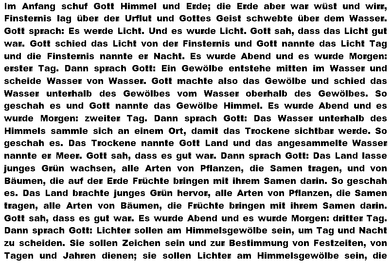

# OCR from scratch

_Maximilian Burger_\
_Lucas Hünniger_

## Table of Contents

- [Task 1](#task-1)
  - [Solution idea](#solution-idea)
  - [Implementation](#implementation)
  - [Testing](#testing)
  - [Interpreations & Limitations](#interpreations--limitations)
- [Task 2](#task-2)
  - [Implementation](#implementation-1)
  - [Testing](#testing-1)
  - [Discussion](#discussion)
- [Experimental Additionals](#experimental-additionals)

## Task 1

### Solution idea

The basic idea as well as some code snippets was given during the lecture.

To implement an own OCR you generally have to do:

1. Binarize the input image
2. Separate text into lines and characters
3. Extract features from characters
4. Compare features to identify matching characters
5. Mark matching characters in the output image

### Implementation

For the binarization, the image is converted to binary (black / white) using some color threshold (e. g. `127`) to distinct between background and foreground.

#### Text Separation

> Showing the code examples here would be a bit overwhelming. Just look in [OCRanalysis.py](./OCRanalysis.py).

To separate the text lines, the whole image is analyzed horizontally to identify text lines by detecting rows of foreground pixels.
If no foreground pixel is found, a new line is created. This behaviour is defined in the function `split_characters()`.

Using the Fire-Through technique, the single lines are then further splitted in to characters. This is defined in the function `split_characters_vertically()`.

To have some interface for each character, the class [`SubImageRegion`](./SubImageRegion.py) is defined.

```python
class SubImageRegion:
    def __init__(self, startX, startY, width, height, origImgArr):
        self.startX = startX
        self.startY = startY
        self.width = width
        self.height = height
        self.subImgArr = np.array([[0] * width for _ in range(height)])

        for x in range(width):
            for y in range(height):
                if 0 <= (y + startY) < len(origImgArr) and 0 <= (x + startX) < len(origImgArr[0]):
                    self.subImgArr[y][x] = origImgArr[y + startY][x + startX]
                else:
                    print(f"Warning: Coordinates ({x + startX}, {y + startY}) are out of bounds for the original image.")
```

#### Features

> Showing the code examples here would be a bit overwhelming. Just look in [ImageFeatures.py](./ImageFeatures.py).

##### Overview

Like said in the task, each feature that was outcommented is now implemented. All the features can be found in [ImageFeatures.py](./ImageFeatures.py). In this task, the following features were used:

- Pixel Count: Total number of foreground pixels
- Maximum X/Y Dimensions: Width and height of the character region
- Centroid-Based Measurements:
  - Average distance of pixels to the centroid
  - Maximum distance of pixels to the centroid
  - Minimum distance of pixels to the centroid
- Character Circularity: Measurement of how circular the character shape is
- Relative Centroid Positions: Position of the character's center relative to its bounding box

##### A basic feature in depth: Circularity

The circularity feature quantifies how closely a character's shape resembles a perfect circle.
This measurement is particularly valuable for distinguishing between round characters
(like 'o', 'O', 'c', 'e') and angular characters (like 'n', 'z', 'v', 'w').

Mathematical Definition
Circularity is defined mathematically as: `4π × Area / Perimeter²`

This formula produces a value between 0 and 1, where:

`1.0` represents a perfect circle
Values approaching 0 indicate irregular shapes.

The algorithm calculates circularity through the following steps:

- Area Calculation:

  - Count the total number of foreground pixels in the character region
  - This provides the area measurement

- Perimeter Calculation:

  - Identify boundary pixels by checking if any of their 8 neighboring pixels is a background pixel
  - A pixel is considered to be on the boundary if:
    - It is a foreground pixel, AND
    - At least one of its 8 neighbors is a background pixel OR is outside the region bounds
  - Count the total number of boundary pixels to determine the perimeter

- Circularity Computation:
  - Apply the formula from above to calculate circularity
  - Return the calculated value as the circularity feature

The circularity feature provides benefits for OCR because it provides different information than
aspect ratio or centroid-based features.

#### Reference Character Selection

The selection of the reference character (the character that should be matched) is just defined by setting the x and y coordinate of the character you want in the image. (zero-based; the spaces between words are not count)

In the future this could be improved to make the image clickable to select one or multiple characters visually.

For this, flags were defined in [OCRanalysis.py](./OCRanalysis.py) that are passed into the `run()` method later:

```python
parser.add_argument("--row", "-r", type=int, default=1,
                    help="Row of target character (0-based) -> default: 1")
parser.add_argument("--column", "-c", type=int, default=3,
                    help="Column of target character (0-based) -> default: 3")
```

### Testing

The testing happens in [main.py](./main.py).

For testing purposes all possible characters and special characters were extracted from the given image. They should be given using this form:

```python
characters = [
...
# row, column, expected symbol, expected count, out file name for seeing the result
(0,    56,     ",",             16,             "marked_comma.png"),
...
]
```

During the test run each result of a character analyzation is printed with the described data and an image is saved in the before defined out file path:

```python
for (row, col, letter, expected_count, out_img_path) in characters:
    full_out_img_path = os.path.join(out_img_dir, out_img_path)

    actual_count = myAnalysis.run(img_path, full_out_img_path, row, col, threshold, shrink_chars=False, only_use_simple_features=True)
    result = "OK" if actual_count == expected_count else "ERROR"
    print(f"Letter: \'{letter}\', Expected Count: {expected_count}, Actual Count: {actual_count}, Result: {result}")
```

At the end an image is generated with all characters overlapped to see what characters were detected more
than once falsely. You can see the file [here](doc/showcase_task1/merged_rt.png).

```python
def merge_images(image_files, out_dir, merged_output_path):
    if not image_files:
        print("No images to merge.")
        return

    # Load the base image
    base_image_path = os.path.join(out_dir, image_files[0])
    result_image = cv2.imread(base_image_path, cv2.IMREAD_GRAYSCALE)

    if result_image is None:
        print(f"Error: Unable to load base image {base_image_path}")
        return

    # Merge subsequent images
    for image_file in image_files[1:]:
        image_path = os.path.join(out_dir, image_file)
        image = cv2.imread(image_path, cv2.IMREAD_GRAYSCALE)

        if image is None:
            print(f"Warning: Unable to load image {image_path}. Skipping.")
            continue

        # Normalize to float for pixel-wise multiplication
        result_float = result_image.astype(float) / 255.0
        image_float = image.astype(float) / 255.0

        # Perform overlay operation
        result_float = result_float * image_float

        # Convert back to uint8
        result_image = (result_float * 255.0).astype(np.uint8)

    # Save the merged image
    cv2.imwrite(merged_output_path, result_image)
    print(f"Merged image saved at: {merged_output_path}")
```

So now just all images can be merged together like this:

```python
image_files = [f for f in os.listdir(out_img_dir)]
merge_images(image_files, out_img_dir, merged_img_path)
```

For running the test for task 1 just adjust the code when executing [main.py](./main.py) or set the following flags when executing [OCRAnalysis.py](./OCRanalysis.py) from the CLI:

```python
shrink_chars=False
only_use_simple_features=True
```

### Test Run

Console Output:

```plaintext
OCR Analysis Results with threshold 0.999:
Letter: ',', Expected Count: 16, Actual Count: 16, Result: OK
Letter: '.', Expected Count: 20, Actual Count: 18, Result: ERROR
Letter: ':', Expected Count: 8, Actual Count: 8, Result: OK
Letter: ';', Expected Count: 2, Actual Count: 2, Result: OK
Letter: 'A', Expected Count: 7, Actual Count: 7, Result: OK
Letter: 'B', Expected Count: 3, Actual Count: 3, Result: OK
Letter: 'D', Expected Count: 8, Actual Count: 8, Result: OK
Letter: 'E', Expected Count: 8, Actual Count: 8, Result: OK
Letter: 'F', Expected Count: 6, Actual Count: 6, Result: OK
Letter: 'G', Expected Count: 23, Actual Count: 19, Result: ERROR
Letter: 'H', Expected Count: 5, Actual Count: 5, Result: OK
Letter: 'I', Expected Count: 1, Actual Count: 1, Result: OK
Letter: 'J', Expected Count: 1, Actual Count: 1, Result: OK
Letter: 'L', Expected Count: 10, Actual Count: 10, Result: OK
Letter: 'M', Expected Count: 4, Actual Count: 4, Result: OK
Letter: 'N', Expected Count: 2, Actual Count: 2, Result: OK
Letter: 'O', Expected Count: 1, Actual Count: 1, Result: OK
Letter: 'P', Expected Count: 2, Actual Count: 2, Result: OK
Letter: 'S', Expected Count: 8, Actual Count: 1, Result: ERROR
Letter: 'T', Expected Count: 8, Actual Count: 8, Result: OK
Letter: 'U', Expected Count: 2, Actual Count: 2, Result: OK
Letter: 'W', Expected Count: 8, Actual Count: 4, Result: ERROR
Letter: 'Z', Expected Count: 1, Actual Count: 1, Result: OK
Letter: 'a', Expected Count: 92, Actual Count: 82, Result: ERROR
Letter: 'b', Expected Count: 22, Actual Count: 16, Result: ERROR
Letter: 'c', Expected Count: 33, Actual Count: 30, Result: ERROR
Letter: 'd', Expected Count: 69, Actual Count: 62, Result: ERROR
Letter: 'e', Expected Count: 169, Actual Count: 151, Result: ERROR
Letter: 'f', Expected Count: 6, Actual Count: 5, Result: ERROR
Letter: 'g', Expected Count: 27, Actual Count: 27, Result: OK
Letter: 'h', Expected Count: 45, Actual Count: 40, Result: ERROR
Letter: 'i', Expected Count: 57, Actual Count: 55, Result: ERROR
Letter: 'j', Expected Count: 2, Actual Count: 2, Result: OK
Letter: 'k', Expected Count: 2, Actual Count: 2, Result: OK
Letter: 'l', Expected Count: 35, Actual Count: 29, Result: ERROR
Letter: 'm', Expected Count: 37, Actual Count: 35, Result: ERROR
Letter: 'n', Expected Count: 115, Actual Count: 112, Result: ERROR
Letter: 'o', Expected Count: 38, Actual Count: 32, Result: ERROR
Letter: 'p', Expected Count: 5, Actual Count: 5, Result: OK
Letter: 'r', Expected Count: 81, Actual Count: 69, Result: ERROR
Letter: 's', Expected Count: 102, Actual Count: 85, Result: ERROR
Letter: 't', Expected Count: 82, Actual Count: 74, Result: ERROR
Letter: 'u', Expected Count: 39, Actual Count: 37, Result: ERROR
Letter: 'v', Expected Count: 10, Actual Count: 7, Result: ERROR
Letter: 'w', Expected Count: 25, Actual Count: 21, Result: ERROR
Letter: 'z', Expected Count: 6, Actual Count: 5, Result: ERROR
Letter: 'ä', Expected Count: 2, Actual Count: 2, Result: OK
Letter: 'ö', Expected Count: 7, Actual Count: 4, Result: ERROR
Letter: 'ü', Expected Count: 7, Actual Count: 7, Result: OK
```

The resulting single letter images can be found in [this directory](doc/showcase_task1/marked_chars).

The final merged overlay image looks like this:


### Interpreations & Limitations

#### Accuracy

> Which letters can be detected in a confident way and which letters lead to problems – and why?

As the high threshold of `0.999` is used, there is not a single false positive in the shown test set.

Characters like commas, colons, semicolons, and various uppercase letters (`A`, `B`, `D`, `E`, `F`, etc.) were detected with perfect or near-perfect accuracy.
This indicates that for characters with distinct structural features and less variation in their appearance, the current feature set and similarity threshold are effective.

Still, many characters were not recognized correctly. Here are some examples:

- `e` was expected `169` times but only detected `151` times.
- `a`: expected `92`, detected `82`
- `s`: expected `102`, detected `85`
- `r`: expected `81`, detected `69`

So the system propably currently struggles with similar shapes like:

- `c`, `e`, `o` or
- `m`, `n`, `r`

One of the most extreme character that stands out is `S`. (expected: 8, actual: 1)


This implies that the features for distinguishing between similar upper and lower case shapes (in this case `s` and `S`) may not be robust enough **yet**. This will be potentially improved by using the aspect ratio after shrinking the actual bounding boxes. [see here](#further-additional-features)

There are also specific character combinations that are connected in the sample image. (possibly to "simulate" fonts with connected letters) You can find every connected letter in [this directory](doc/connected_letters).

You can e. g. see here the problematic letter combination `rt`. If you really zoom in you can see that both are connected.


You can then see the recognized `r` and `t` using the algorithm from task 1. You can see that e. g. the three words "Arten" are completely missing as all 3 of them have the described connected letter group.



The characters don't even have to be connected. When the fire through algorithm cannot "shoot" through the characters, then things mess up quickly. You can see this e. g. between the letters `z` and `w` in the word "zweiter":


#### Fonts

> Are all fonts applicable to this kind of OCR strategy – why or why not?

Not all fonts are applicable. In this case, the OCR is optimized for handling the font used in the given image.

Other fonts could lead to accuracy or general detection problems due to e. g.:

- serifs (leads to connected characters like described above)
- italic font styles (vertical splitting could become problematic and the aspect ratios are modified)
- weight (too bold = characters possibly are merging; too thin = characters may disappear during binarization -> see [here](#experimental-additionals)
- variable stroke widths and font consistency ( ; see Times New Roman)
- character distinctiveness (when differentiating letters is hard; e. g. `l` vs. `I`)
- ...

#### Other Character Dependency

> Does classification accuracy depend on the other characters in the specific line – if that’s the case: why and how to overcome this issue?

Yes, classification accuracy definitely depends on other characters within the same line.
The implementation uses the `split_characters_vertically` function to identify character boundaries within each line.
When characters are positioned closely together or have specific combinations (like "rt"),
segmentation can be imperfect. The approach relies on finding empty columns between characters, which may not
exist when characters touch or overlap. Also, when characters aren't properly segmented, features calculated for these
regions become distorted. E.g. a joined "rt" will have different circularity, aspect ratio, and centroid-based measurements
than individual 'r' and 't'.

Imrovement ideas:

- Better character segmentation (Contour Analysis, Watershed, ...)
- Sliding Window approach (scan from left to right over the character sequence and classify the most probable sequence)
- Junction Detection to identify and handle character junctions where segmentation is challenging.

## Task 2

### Implementation

#### Character Dimension Region Shrinking

Region shrinking is used to enhance the accuracy of character detection by adjusting the bounding box to closely match the edges of the actual character. This step eliminates unnecessary white space around characters.

For this a flag `--shrink_chars` as well as the function `limit_characters_vertically()` was introduced in [OCRanalysis.py](./OCRanalysis.py). If the flag is not set to true, the characters won't be shrunk.

What is done:

1. The first non empty rows from top and buttom are searched.
2. Extract the starting y position.
3. Extract the height of the character.

After that the two values are returned and the [`SubImageRegion`](./SubImageRegion.py) class used to actually shrink the image.

```python
def limit_character_vertically(char_region, BG_val):
    """
    Find the top and bottom bounds of the character within the region.
    Returns start_y and height of the actual character.
    """
    height = char_region.height
    width = char_region.width

    # Find the first non-empty row from top
    start_y = 0
    while start_y < height:
        empty_row = True
        for x in range(width):
            if char_region.subImgArr[start_y][x] != BG_val:
                empty_row = False
                break
        if not empty_row:
            break
        start_y += 1

    # Find the first non-empty row from bottom
    end_y = height - 1
    while end_y >= start_y:
        empty_row = True
        for x in range(width):
            if char_region.subImgArr[end_y][x] != BG_val:
                empty_row = False
                break
        if not empty_row:
            break
        end_y -= 1

    # Calculate actual character height
    char_height = end_y - start_y + 1

    # Ensure minimum height
    if char_height < 2:
        char_height = 2
        if start_y + char_height > height:
            start_y = height - char_height

    return start_y, char_height
```

#### Further additional features

> Showing the code examples here would be a bit overwhelming. Just look in [ImageFeatures.py](./ImageFeatures.py).

**Hole Count** helps us to identificate characters with a different number of holes. This can be seen when comparing e. g. the characters `B` and `P`.

**Vertical Symmetry** helps to distinguish characters that are vertically symmetrical from those that are not. For example, `A` shows strong vertical symmetry, while `F` does not.

**Horizontal Symmetry** supports the differentiation between characters based on their symmetry along the horizontal axis. For instance, `H` has high horizontal symmetry, whereas `L` lacks it.

**Aspect Ratio** is possible after successfully applying the region shrinking only on the real edges of the characters. ([see here](#character-dimension-region-shrinking)) It helps to differentiate e. g. wide characters like `w` from not that wide characters like `v`.

**Pixel Density** measures how many foreground pixels are occupied relative to the total amount of pixels of the bounding box of the character. It can help differentiate between characters like `M`, which tends to be denser, and `i`, which covers much less area.

### Testing

This is the same like described in [Task 1](#task-1). Now just more features (`only_use_simple_features=False`) and adjusted logic for shrinking (`shrink_chars=True`) are used.

#### Test Run

Console Output:

```plaintext
OCR Analysis Results with threshold 0.999:
Letter: ',', Expected Count: 16, Actual Count: 16, Result: OK
Letter: '.', Expected Count: 20, Actual Count: 20, Result: OK
Letter: ':', Expected Count: 8, Actual Count: 8, Result: OK
Letter: ';', Expected Count: 2, Actual Count: 2, Result: OK
Letter: 'A', Expected Count: 7, Actual Count: 7, Result: OK
Letter: 'B', Expected Count: 3, Actual Count: 3, Result: OK
Letter: 'D', Expected Count: 8, Actual Count: 8, Result: OK
Letter: 'E', Expected Count: 8, Actual Count: 8, Result: OK
Letter: 'F', Expected Count: 6, Actual Count: 6, Result: OK
Letter: 'G', Expected Count: 23, Actual Count: 23, Result: OK
Letter: 'H', Expected Count: 5, Actual Count: 5, Result: OK
Letter: 'I', Expected Count: 1, Actual Count: 1, Result: OK
Letter: 'J', Expected Count: 1, Actual Count: 1, Result: OK
Letter: 'L', Expected Count: 10, Actual Count: 10, Result: OK
Letter: 'M', Expected Count: 4, Actual Count: 4, Result: OK
Letter: 'N', Expected Count: 2, Actual Count: 2, Result: OK
Letter: 'O', Expected Count: 1, Actual Count: 1, Result: OK
Letter: 'P', Expected Count: 2, Actual Count: 2, Result: OK
Letter: 'S', Expected Count: 8, Actual Count: 8, Result: OK
Letter: 'T', Expected Count: 8, Actual Count: 8, Result: OK
Letter: 'U', Expected Count: 2, Actual Count: 2, Result: OK
Letter: 'W', Expected Count: 8, Actual Count: 8, Result: OK
Letter: 'Z', Expected Count: 1, Actual Count: 1, Result: OK
Letter: 'a', Expected Count: 92, Actual Count: 92, Result: OK
Letter: 'b', Expected Count: 22, Actual Count: 22, Result: OK
Letter: 'c', Expected Count: 33, Actual Count: 33, Result: OK
Letter: 'd', Expected Count: 69, Actual Count: 69, Result: OK
Letter: 'e', Expected Count: 169, Actual Count: 169, Result: OK
Letter: 'f', Expected Count: 6, Actual Count: 5, Result: ERROR
Letter: 'g', Expected Count: 27, Actual Count: 27, Result: OK
Letter: 'h', Expected Count: 45, Actual Count: 45, Result: OK
Letter: 'i', Expected Count: 57, Actual Count: 57, Result: OK
Letter: 'j', Expected Count: 2, Actual Count: 2, Result: OK
Letter: 'k', Expected Count: 2, Actual Count: 2, Result: OK
Letter: 'l', Expected Count: 35, Actual Count: 35, Result: OK
Letter: 'm', Expected Count: 37, Actual Count: 37, Result: OK
Letter: 'n', Expected Count: 115, Actual Count: 115, Result: OK
Letter: 'o', Expected Count: 38, Actual Count: 38, Result: OK
Letter: 'p', Expected Count: 5, Actual Count: 5, Result: OK
Letter: 'r', Expected Count: 81, Actual Count: 75, Result: ERROR
Letter: 's', Expected Count: 102, Actual Count: 102, Result: OK
Letter: 't', Expected Count: 82, Actual Count: 78, Result: ERROR
Letter: 'u', Expected Count: 39, Actual Count: 39, Result: OK
Letter: 'v', Expected Count: 10, Actual Count: 9, Result: ERROR
Letter: 'w', Expected Count: 25, Actual Count: 24, Result: ERROR
Letter: 'z', Expected Count: 6, Actual Count: 5, Result: ERROR
Letter: 'ä', Expected Count: 2, Actual Count: 2, Result: OK
Letter: 'ö', Expected Count: 7, Actual Count: 7, Result: OK
Letter: 'ü', Expected Count: 7, Actual Count: 7, Result: OK
Merging images...
Merged image saved at: merged_overlay.png
```

The resulting single letter images can be found in [this directory](doc/showcase_task2/marked_chars).

The final merged overlay image looks like this:


### Discussion

#### Ensure that the split characters image region is shrinked to its bounding box. How can that help to improve result quality?

The implementation includes the `limit_character_vertically` function to shrink character regions to their actual bounding boxes.
This improves result quality in several ways:

- More Accurate Feature Measurements: When characters are tightly bounded, features like aspect ratio, circularity,
  and pixel density reflect the actual character shape rather than being diluted by excess background space.
- Better Feature Differentiation: Characters like 'i' and 'l' have distinct height-to-width ratios, but this distinction
  becomes much clearer when extra vertical whitespace is removed.
- Improved Centroid Calculations: The centroid position becomes more representative of the character's true center of mass,
  making centroid-based features (average/max/min distance) more descriptive.
- Consistent Scale for Comparison: Characters with the same actual shape but different surrounding whitespace
  (due to segmentation variations) now produce more similar feature vectors.

In the test results, shrinking enabled perfect recognition for many characters that were previously misclassified,
like uppercase 'G' (improving from 19/23 to 23/23 correct) and some lowercase letters.
The letter 'S'/'s' benefits especially from character shrinking and additional features. Shrinking enabled accurate measurement
of the proportions of the shape of 'S'/'s'. The shapes also have a specific aspect ratio when properly bounded.
This lead to following observations:

- Uppercase 'S': Improved from 1/8 correct (12.5%) to 8/8 correct (100%)
- Lowercase 's': Improved from 85/102 correct (83.3%) to 102/102 correct (100%)

You can see the visualization for the lower and upper case version in the following table:

| `s`                                                       | `S`                                                       |
| --------------------------------------------------------- | --------------------------------------------------------- |
|  |  |

The other missing are due to the connected letters issue described in [Task 1](#task-1). This means, that the current algorithm works fine for the given sample image.

#### Discuss the normalization process – how does character occurrence probability influence the results?

The normalization process calculates average feature values across all character regions and uses these averages
to normalize individual feature measurements. This approach is influenced by character occurrence probability in these ways:

- Frequency Bias: Frequently occurring characters (like 'e', which appears 169 times) have a greater influence on the average
  values than rare characters (like 'Z', which appears only once).
- Statistical Reliability: Features that remain stable across different instances of the same character (like hole count)
  will be more reliably normalized than features with high variance.
- Outlier Impact: Rare characters with unusual feature values may be disadvantaged in the comparison
  because their features will be normalized against averages dominated by common characters.

#### Discuss how the classification process itself could be improved. Are there better strategies for feature-based classification?

During the implementation, several improvement ideas were discussed:

- Feature Weighting: Not all features are equally discriminative. Assigning weights to features based on their discriminative power could improve results.
  For example, hole count might be more decisive than pixel count.
- Machine Learning Classifiers: Using classifiers like Random Forests or Neural Networks could
  learn optimal feature combinations and decision boundaries.
- Multi-Stage Classification: First separate characters into broad categories (e.g., circular vs. angular, with holes vs. without)
  then refine with detailed comparison.
- Template Matching Hybrid: Combine feature-based approach with template matching for ambiguous cases (e.g., distinguish 't' and
  'r' using both features and cross-correlation).
- Dynamic Thresholds: Adjust the correlation threshold based on the specific reference character or character category
  rather than using a fixed threshold.

> Incorporating language knowledge and contextual information from neighboring characters can also improve OCR classification,
> although there we are leaving the field of feature-based classification.

#### How does correlation of some of the features itself influence the achievable classification results (e.g. max-distance-from-centroid will somehow be correlated to the specific width)?

The implementation uses features that are correlated. As already stated in the question, the maximum distance
from centroid is naturally correlated with the character's width or height. This means these features partially
duplicate information. The correlation between features impacts classification in at least three ways:

- Redundant Information: Correlated features essentially count the same characteristic multiple times in the
  comparison, giving it disproportionate weight.
- Dimensionality Issues: With correlated features, the 14-dimensional feature vector effectively has lower
  "true" dimensionality, making some character distinctions harder.
- Noise Amplification: If a character varies in one feature (e.g., width), correlated features will also vary,
  amplifying the deviation in the feature vector.

The improvement between Task 1 and Task 2 suggests that despite these correlations, the additional features still contribute
valuable new information, especially hole count and symmetry measurements that provide information not captured by the
basic dimensional features.

## Experimental Additionals

When trying other images that were created using tools like Inkscape or Photopea, the anti aliasing of the image rendering creates every character kinda in its own unique shape.

The first assumption was that the characters are too near to each other which is why I added some character spacing like you can see in this merged overlays image:


After that, the threshold was reduced to allow matching characters with a small level of unaccuracy. This also did not work. Even when disabling antialiasing in Inkscape, the output image was not a good fit for our implementation of the OCR algorithm. You can see all the results in [this directory](./doc/inkscape_without_anti_aliasing_and_with_character_spacing).

As described in [Task 1](#task-1) due to the fonts, a too thin font was tested. You can see all the results in [this directory](./doc/inkscape_too_thin).

We can see in the merged overalay image that many characters like e. g. `w` or `r` were destructed due to the binarization. Also here every character often looks different.


